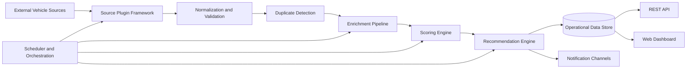
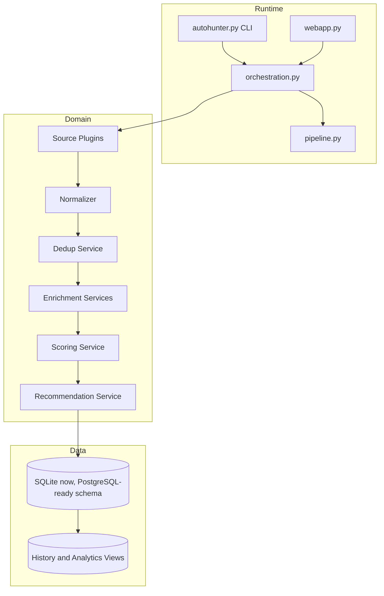
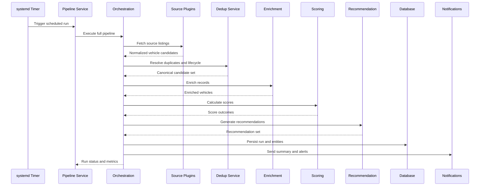

# CarHunter v3 Architecture

Version: 3.0 (Phase 1 - Software Architecture and Product Design)

Date: 2026-07-25

Author: Lead Release Engineering and Architecture Team

Status: Authoritative Design Baseline

## Revision History

| Version | Date | Author | Change Summary |
|---|---|---|---|
| 3.0-pha1 | 2026-07-25 | Lead Release Engineering and Architecture Team | Initial authoritative v3 architecture, compatibility-first evolution from v2.9 |

## Table of Contents

<!-- markdown-toc start -->
- [1. Executive Summary](#1-executive-summary)
- [2. Product Vision](#2-product-vision)
- [3. Goals](#3-goals)
- [4. Functional Requirements](#4-functional-requirements)
- [5. Non Functional Requirements](#5-non-functional-requirements)
- [6. High Level Architecture](#6-high-level-architecture)
- [7. Source Framework](#7-source-framework)
- [8. Vehicle Normalization](#8-vehicle-normalization)
- [9. Duplicate Detection](#9-duplicate-detection)
- [10. Enrichment Framework](#10-enrichment-framework)
- [11. Scoring Engine](#11-scoring-engine)
- [12. Recommendation Engine](#12-recommendation-engine)
- [13. Scheduler](#13-scheduler)
- [14. REST API](#14-rest-api)
- [15. Dashboard](#15-dashboard)
- [16. Database](#16-database)
- [17. Logging](#17-logging)
- [18. Configuration](#18-configuration)
- [19. Testing Strategy](#19-testing-strategy)
- [20. CI/CD](#20-cicd)
- [21. Git Strategy](#21-git-strategy)
- [22. Architecture Decision Records](#22-architecture-decision-records)
- [23. Future Roadmap](#23-future-roadmap)
- [Architecture Review](#architecture-review)
- [Technical Risks](#technical-risks)
- [Recommendations](#recommendations)
- [Sprint Plan for v3.0](#sprint-plan-for-v30)
<!-- markdown-toc end -->

## 1. Executive Summary

CarHunter v3 is defined as a compatibility-first evolution of the validated v2.9 platform, not a rewrite. The architecture introduces extensibility, observability, and multi-source readiness while preserving current production behavior and release safety.

The strategic shift is from a single-source scraper application to an automotive intelligence platform with a modular source framework, normalized vehicle domain model, deterministic orchestration, and enterprise-grade operational controls.

Key architectural principle: every v3 capability must be deployable incrementally without breaking existing v2.9 data flow, scoring output contracts, and service-level operational procedures.

## 2. Product Vision

CarHunter should evolve into a complete automotive intelligence platform that:

- Aggregates listings from multiple marketplaces and data providers.
- Normalizes heterogeneous source data into one durable domain model.
- Detects duplicate and re-listed vehicles with high precision.
- Produces explainable scores and recommendations for decision support.
- Provides real-time and historical market intelligence through API and dashboard channels.
- Supports enterprise operations through auditable releases, observable pipelines, and controlled rollback.

Vision horizon:

- Near term (v3.x): modularity, source expansion, robust normalization, and operational hardening.
- Mid term (v4.x): platform-scale API ecosystem, advanced analytics, and data products.

## 3. Goals

### 3.1 Business Goals

| Goal | Outcome |
|---|---|
| Expand inventory intelligence | Support multiple listing sources and enrichment providers |
| Improve recommendation trust | Explainable scoring and recommendation traces |
| Reduce missed opportunities | Better duplicate handling, alert quality, and historical tracking |

### 3.2 Technical Goals

| Goal | Outcome |
|---|---|
| Preserve compatibility | Existing v2.9 workflows remain functional |
| Improve modularity | Plugin-based source and enrichment architecture |
| Standardize domain model | One canonical Car aggregate for all sources |
| Strengthen observability | Structured logs, metrics, and traceable pipeline runs |

### 3.3 Operational Goals

| Goal | Outcome |
|---|---|
| Safer releases | Repeatable release and operational validation gates |
| Better reliability | Predictable scheduler behavior and failure containment |
| Faster incident response | Run-level telemetry and explicit ownership boundaries |

## 4. Functional Requirements

| Area | Requirement |
|---|---|
| Multi-source support | Ingest AutoScout24 and additional sources through a common contract |
| Plugin architecture | Add or disable source connectors without changing core pipeline |
| Vehicle normalization | Convert each source payload into one canonical internal Car model |
| Duplicate detection | Multi-signal matching using VIN, registration, fingerprint, URL, dealer, and similarity |
| Scoring | Maintain current scoring and allow extensible scoring factors |
| Recommendations | Explainable recommendation workflow with confidence output |
| Alerts | Trigger notifications on new opportunities, score thresholds, and relevant changes |
| Dashboard | Operational + analytical views across current and historical inventory |
| API | Read and query endpoints for inventory, scoring, recommendations, and pipeline state |
| Search | Faceted, sortable, filterable search over normalized and enriched fields |
| Historical tracking | Preserve lifecycle state transitions and market changes over time |

## 5. Non Functional Requirements

| Category | Requirement |
|---|---|
| Performance | Daily full run completion within operational window; bounded API latency for key queries |
| Reliability | Deterministic retries, idempotent stages, and failure isolation |
| Security | Secrets separation, least privilege service accounts, auditable operational actions |
| Scalability | Horizontal source/enrichment expansion without rewriting core orchestration |
| Maintainability | Clear module boundaries, stable interfaces, low coupling |
| Testability | Unit, integration, regression, and pipeline validation test layers |
| Observability | Structured logs, run metrics, stage telemetry, and actionable alerting |

## 6. High Level Architecture

### 6.1 Platform Context



### 6.2 Component View (Compatibility-first)



### 6.3 Sequence: Daily Full Pipeline Run



## 7. Source Framework

### 7.1 Design

Source plugins implement a common interface and are loaded by registry configuration, not hardcoded imports.

Proposed framework structure:

```text
sources/
        base.py
        autoscout.py
        gaspedaal.py
        mobile_de.py
        autotrack.py
        das_import.py
```

Common source interface responsibilities:

- Source metadata (name, version, capabilities)
- Discovery/query translation
- Fetch/listing pagination
- Raw payload validation
- Mapping to canonical Car model
- Source health and diagnostics

### 7.2 Source Plugin Decision Table

| Decision | Choice | Rationale |
|---|---|---|
| Plugin loading | Config registry | Avoids core changes when adding sources |
| Failure behavior | Isolated source failure | One source failure must not collapse full pipeline |
| Output contract | Canonical Car payload only | Keeps downstream logic source-agnostic |

## 8. Vehicle Normalization

Canonical Car model is the single source of truth for business logic.

Core model domains:

- Identity: source_id, source_name, external_id, canonical_vehicle_id
- Listing: URL, price, currency, first_seen_at, last_seen_at, listing_status
- Vehicle facts: brand, model, trim, year, mileage, fuel, transmission, power, body
- Dealer context: dealer_id, dealer_name, region
- Enrichment: VIN-derived details, tax data, market indicators
- Scoring and recommendation fields

Normalization rules:

- Standard units (km, kW/HP, ISO timestamps)
- Controlled vocabularies for fuel/transmission/body style
- Explicit null semantics for unavailable fields
- Provenance metadata per normalized field

## 9. Duplicate Detection

### 9.1 Signal Hierarchy

| Signal | Confidence | Notes |
|---|---|---|
| VIN exact match | Very High | Primary deterministic identity where available |
| Registration + dealer | High | Strong in regional contexts |
| Fingerprint hash | High | Deterministic composite of stable features |
| URL continuity | Medium | Useful for listing continuity, weaker for re-listing |
| Dealer + similarity profile | Medium | Useful when strong identifiers are absent |
| Fuzzy textual similarity | Low to Medium | Safety net, requires threshold governance |

### 9.2 Matching Policy

- Deterministic-first strategy.
- Weighted similarity fallback only when deterministic keys absent.
- Human-auditable match explanation stored with match decision.
- False positive minimization prioritized over aggressive merge.

## 10. Enrichment Framework

Enrichment stages are modular and independently configurable.

Candidate enrichment providers:

- RDW data
- DAS Import data
- VIN Decoder providers
- AI-assisted description and option extraction
- BPM and ownership cost estimators

Pipeline pattern:

- Input: canonical Car
- Context: provider credentials and feature flags
- Output: versioned enrichment payload + quality score
- Policy: soft-fail non-critical enrichments, hard-fail only on mandatory controls

## 11. Scoring Engine

### 11.1 Current State (v2.9)

- Existing production factors and thresholds are preserved.
- Existing personal_score and final_score semantics remain authoritative.

### 11.2 Future State (v3)

- Score factors become declarative and versioned.
- Explainability payload is first-class output.
- Scenario profiles (conservative, balanced, opportunity-seeking).
- Backtesting harness against historical outcomes.

Compatibility guarantee:

- v2.9 score outputs remain reproducible under default v3 compatibility profile.

## 12. Recommendation Engine

Recommendation pipeline stages:

1. Eligibility filter
2. Constraint and preference alignment
3. Score and risk composite ranking
4. Explainability rendering
5. Notification eligibility

Recommendation output contract:

- recommendation_rank
- recommendation_reasons
- confidence_band
- actionability_flags

## 13. Scheduler

Scheduler architecture keeps systemd timer and service operationally compatible, while introducing stricter orchestration controls:

- Explicit run IDs and stage checkpoints
- Idempotent stage semantics
- Resume and re-run strategy per stage
- Operational lock control to avoid overlapping full runs

## 14. REST API

### 14.1 API Surface (v3 target)

| Endpoint | Method | Purpose |
|---|---|---|
| /api/v1/health | GET | Service and dependency health |
| /api/v1/runs | GET | Pipeline run history and status |
| /api/v1/runs/{id} | GET | Detailed run metrics and stage outcomes |
| /api/v1/vehicles | GET | Search and filter normalized vehicles |
| /api/v1/vehicles/{id} | GET | Vehicle detail including enrichment and score traces |
| /api/v1/recommendations | GET | Current recommendation set |
| /api/v1/alerts | GET | Alert history and state |

API principles:

- Backward-compatible field evolution
- Stable pagination and sorting contracts
- Strict response schemas and versioning

## 15. Dashboard

Future dashboard architecture:

- API-driven view model layer
- Reusable components for run health, inventory, scoring, and recommendations
- Filter and search parity with API semantics
- Real-time operational widgets for pipeline and scheduler status

UI requirements:

- Desktop and mobile functional parity for core workflows
- Explainability views for score/recommendation transparency

## 16. Database

### 16.1 Near-Term (SQLite)

- SQLite remains valid for single-node operational simplicity and existing compatibility.
- Schema evolves with additive, backward-compatible changes.

### 16.2 PostgreSQL Transition Rationale

| Driver | Why PostgreSQL Eventually |
|---|---|
| Concurrency | Better write concurrency and lock behavior for expanding workloads |
| Scale | Stronger indexing, partitioning, and analytics support |
| Operations | Mature backup, replication, and observability tooling |
| Ecosystem | Improved integration with API and analytics stack |

### 16.3 Future Schema Domains

- vehicles (canonical)
- listings (source-specific lifecycle)
- enrichments (provider-versioned)
- scores (score version and explainability)
- recommendations
- pipeline_runs and stage_runs
- alerts and notification events
- audit_events

## 17. Logging

Logging standard:

- Structured logs (JSON-ready) with run_id, stage_id, source_name, vehicle_id where applicable
- Severity taxonomy aligned to operations runbook
- Correlation IDs spanning fetch, normalization, scoring, and notification stages
- Explicit log retention and rotation policies

## 18. Configuration

Configuration hierarchy:

1. Environment defaults (safe baseline)
2. Version-scoped config file
3. Secure secret providers/environment variables
4. Runtime feature flags

Configuration controls:

- Source enablement matrix
- Enrichment provider toggles
- Scoring profile selection
- Operational safety limits (timeouts, retries, rate limits)

## 19. Testing Strategy

| Test Layer | Purpose |
|---|---|
| Unit tests | Module-level correctness, deterministic business rules |
| Integration tests | Cross-module workflows (source -> normalize -> persist) |
| Regression tests | Preserve v2.9 behavioral contracts and scoring compatibility |
| Pipeline validation | Full-run integrity, scheduler path, stage order, run summaries |

Testing guardrails:

- Golden datasets for score reproducibility
- Source contract tests for plugin compliance
- Migration tests for schema compatibility

## 20. CI/CD

GitHub Actions target pipeline:

- PR pipeline: lint, unit, integration, contract tests
- Main/release pipeline: regression + operational smoke checks
- Release pipeline: tag validation, documentation completeness, release artifact publication

Deployment controls:

- Environment-specific promotion checks
- Service path and port assertions
- Rollback readiness verification

## 21. Git Strategy

| Branch | Role |
|---|---|
| main | Production-ready, release-tracked |
| v3.0-dev | Active integration branch for v3 line |
| feature/* | Isolated feature delivery |
| release/* | Stabilization and final verification |
| hotfix/* | Urgent production remediations |

Rules:

- Protected branches with required checks
- Conventional commit messages
- Release tags on validated production commits

## 22. Architecture Decision Records

ADR structure:

```text
docs/adr/
        0001-template.md
        0002-source-plugin-contract.md
        0003-canonical-vehicle-model.md
        0004-dedup-strategy.md
        0005-sqlite-to-postgresql-transition.md
```

ADR template fields:

- Title
- Status (Proposed, Accepted, Superseded)
- Context
- Decision
- Consequences
- Compatibility impact
- Rollout and rollback notes

## 23. Future Roadmap

### v3.1

- Introduce second and third source plugins in production pilot.
- Deploy canonical normalization validation suite.
- Add score explainability payload to API and dashboard.

### v3.2

- Activate enrichment provider chain with quality scoring.
- Add advanced duplicate similarity diagnostics.
- Harden CI/CD with release gate automation.

### v4.0

- Optional PostgreSQL primary data store migration.
- Expand API ecosystem and partner integrations.
- Introduce analytics-grade historical trend modules.

## Architecture Review

Review outcome: approved as a compatibility-first enterprise architecture baseline for CarHunter v3 Phase 1.

Conformance to design principles:

- SOLID: modular responsibilities and explicit interfaces
- DRY: shared domain model and orchestration contracts
- KISS: incremental evolution over rewrite
- Clean Architecture: infrastructure and source concerns isolated from domain workflows
- Composition over inheritance: plugin and enrichment composition strategy

## Technical Risks

| Risk | Probability | Impact | Mitigation |
|---|---|---|---|
| Source quality variability | High | Medium | Contract tests, normalization validation, quality scoring |
| Duplicate false positives | Medium | High | Deterministic-first strategy and auditable match rationale |
| SQLite concurrency constraints | Medium | Medium | Operational locking and phased PostgreSQL transition plan |
| Release drift across envs | Medium | High | Automated release validation and service path assertions |

## Recommendations

1. Keep v2.9 compatibility profile as mandatory default through v3.1.
2. Deliver source plugin contract and canonical model before expanding source count.
3. Prioritize observability instrumentation in parallel with functional expansion.
4. Adopt ADR discipline before major schema or orchestration changes.
5. Use release and operational validation gates as non-optional controls.

## Sprint Plan for v3.0

| Sprint | Scope | Exit Criteria |
|---|---|---|
| Sprint 1 | Source plugin contract + autoscout adapter alignment | Existing source runs through plugin interface with parity |
| Sprint 2 | Canonical normalization + duplicate service baseline | Normalization and dedup pass regression datasets |
| Sprint 3 | Enrichment framework skeleton + API foundation | Enrichment pipeline integrated with run telemetry |
| Sprint 4 | Dashboard/API compatibility + release automation hardening | Operational validation fully scripted and repeatable |
