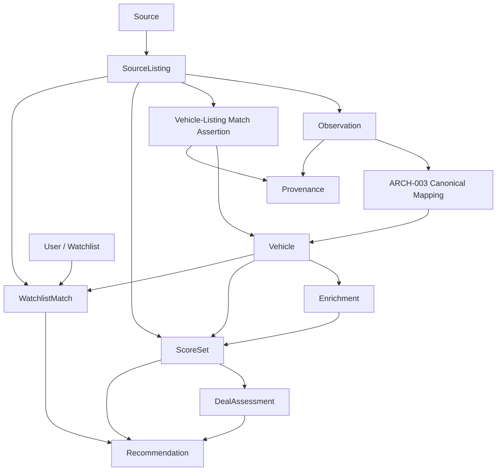

# ARCH-003 - Canonical Car / Domain Model

## 1. Document Status

- **Document ID:** ARCH-003
- **Project:** CarHunter v3
- **Status:** Draft 1.0
- **Scope Type:** Architecture Definition
- **Primary Baseline:** [docs/ARCHITECTURE.md](../ARCHITECTURE.md)

### 1.1 Status Markers Used in This Document

- **CURRENT FACT** - directly supported by the current repository implementation or checked-in documentation
- **CURRENT LIMITATION** - directly supported gap or constraint in the current repository implementation
- **ARCHITECTURAL DECISION** - approved design decision for the canonical domain model
- **FUTURE DESIGN** - intended target architecture, not yet implemented
- **MIGRATION PRINCIPLE** - compatibility-preserving rule for evolving from current state
- **OPEN QUESTION** - unresolved point intentionally deferred

## 2. Purpose

ARCH-003 defines the canonical CarHunter domain model boundary that begins **after** the source framework handoff defined by ARCH-002.

This document defines:

- canonical domain concepts
- identity boundaries
- Listing versus Vehicle semantics
- Observation and provenance semantics
- enrichment boundaries
- derived-state boundaries for scoring, deal assessment, recommendation, and watchlist logic
- the conceptual relationship between the canonical model and the current compatibility projection in `cars`

This document does **not** redesign source acquisition, source adapters, source request policy, or plugin loading.

## 3. Scope

### 3.1 In Scope

- canonical domain ownership
- Vehicle identity as the canonical identity root
- Listing and Source identity boundaries
- Observation as time-bound source-reported state
- provenance preservation requirements
- enrichment ownership
- derived/application state boundaries
- conceptual migration relationship with the current [cars table](../../database.py#L548)

### 3.2 Out of Scope

- source adapter contracts
- fetch, retry, throttling, or source capability design
- immediate database rewrite
- concrete ORM or class implementation
- concrete API redesign
- generic plugin infrastructure
- speculative technology choices beyond current SQLite compatibility

## 4. Architectural Context

### 4.1 CURRENT FACT

The current repository implements a single-source, AutoScout24-oriented workflow centered on:

- source scraping and normalization in [scraper.py](../../scraper.py)
- orchestration in [orchestration.py](../../orchestration.py)
- persistence in [database.py](../../database.py)
- row mapping in [models.py](../../models.py)

The current top-level architecture baseline says CarHunter is evolving toward a normalized vehicle domain model while preserving compatibility-first behavior in [docs/ARCHITECTURE.md](../ARCHITECTURE.md).

### 4.2 ARCHITECTURAL DECISION

ARCH-002 ends at the source-owned handoff boundary:

```text
Source Adapter
    -> SourceSnapshot
    -> ARCH-003 canonical mapping
    -> Canonical Domain Model
```

ARCH-003 begins where `SourceSnapshot` data becomes canonical business/domain data.

### 4.3 ARCHITECTURAL DECISION

ARCH-003 is aligned to the stable architecture baseline:

```text
ARCH-001
    -> ARCH-002 Source Framework
        -> Source Adapter
        -> SourceSnapshot
        -> ARCH-003 canonical mapping
        -> Canonical Domain Model
```

ARCH-001 remains the system-wide architectural authority, and ARCH-002 remains the authority for the source-framework boundary that feeds ARCH-003.

## 5. Design Principles

### 5.1 ARCHITECTURAL DECISION

1. **Vehicle is the canonical identity root.**
2. **Listing identity is not Vehicle identity.**
3. **Identity confidence must be explicit when evidence is weak.**
4. **Observations are time-bound and conceptually immutable.**
5. **Source data, enrichment, and derived values must remain conceptually separate.**
6. **Scores, recommendations, and watchlist state are not intrinsic properties of Vehicle.**
7. **The current `cars` table remains a compatibility projection during migration.**

### 5.2 MIGRATION PRINCIPLE

The target semantic model must be defined without requiring immediate replacement of the current runtime path:

```text
Canonical Domain Model
    -> Compatibility Projection
    -> cars
    -> Existing v3 services
```

## 6. Canonical Domain Model

### 6.1 FUTURE DESIGN

The candidate canonical model is centered on these conceptual domains:

- **Source**
- **Listing**
- **Observation**
- **Vehicle**
- **Provenance**
- **Enrichment**
- **ScoreSet**
- **DealAssessment**
- **Recommendation**
- **WatchlistMatch / User Context**

### 6.2 Conceptual Model



### 6.3 CURRENT LIMITATION

The current implementation does not yet model these as separate persisted entities. Today, most of them are collapsed into one [Car](../../models.py#L7) row projection backed by the `cars` table.

## 7. Vehicle

### 7.1 ARCHITECTURAL DECISION

**Vehicle** is the canonical identity root.

A Vehicle represents the physical vehicle that CarHunter believes one or more listings refer to.

### 7.2 FUTURE DESIGN

Vehicle should own:

- canonical vehicle identity
- canonical stable vehicle facts
- canonical relationships to one or more Listings

Vehicle should **not** own:

- source-specific listing identifiers
- source fetch timing
- raw source payloads
- match confidence that a particular Listing refers to the Vehicle
- matching evidence or matching method for a specific Listing-to-Vehicle link
- current user preference matches
- current recommendation state

### 7.3 CURRENT LIMITATION

The current implementation does not reliably separate physical Vehicle identity from marketplace Listing identity:

- [cars.autoscout_id](../../database.py#L553) is listing/source identity
- [cars.fingerprint](../../database.py#L554) is heuristic matching evidence
- [save_car](../../database.py#L275) updates one row when either `fingerprint` or `autoscout_id` matches

## 8. Listing

### 8.1 ARCHITECTURAL DECISION

A **Listing** represents a marketplace/source advertisement, not the physical vehicle itself.

### 8.2 FUTURE DESIGN

Listing should own:

- reference to Source
- source listing identity
- source URL
- listing lifecycle state
- listing continuity over time
- relationship to Observations

Listing should **not** own:

- canonical vehicle identity root
- user-specific watchlist preferences
- intrinsic vehicle meaning of derived scores

### 8.3 CURRENT FACT

Current listing-like data exists only as fields inside the `cars` row:

- `autoscout_id`
- `url`
- `first_seen`
- `last_seen`
- `sold`
- `sold_at`
- `status`

These are written by [save_car](../../database.py#L265) and [mark_missing_cars_sold](../../database.py#L1163).

## 9. Source

### 9.1 ARCHITECTURAL DECISION

Source is a canonical reference concept representing where a Listing originated.

### 9.2 FUTURE DESIGN

Source should own:

- source identity
- stable source reference semantics
- source-level context defined by the source framework boundary

Listing should reference Source, but should not replace or absorb the Source concept.

### 9.3 CURRENT FACT

The active implementation is AutoScout24-specific:

- base URL in [BASE_URL](../../scraper.py#L14)
- listing discovery in [fetch_page](../../scraper.py#L395) and [parse_page](../../scraper.py#L403)
- detail fetch in [fetch_car_details](../../scraper.py#L238)

### 9.4 CURRENT LIMITATION

There is no persisted `source_name` or source entity in the current schema. Source identity is implicit in the code path and URL structure.

## 10. Observation

### 10.1 ARCHITECTURAL DECISION

An **Observation** is a time-bound record of what a SourceListing reported at a specific point in time.

### 10.2 ARCHITECTURAL DECISION

Observations are conceptually immutable.

If a listing changes price, mileage, options, or other reported facts, that change is represented by a **new Observation**, not by redefining the prior Observation.

### 10.3 FUTURE DESIGN

Observation should conceptually own:

- observed source values
- observation timestamp
- relationship to SourceListing
- provenance of observed fields

### 10.4 CURRENT LIMITATION

The current implementation overwrites most source-observed state into one mutable `cars` row through [save_car](../../database.py#L335), rather than storing an observation history.

The only partial historical trace currently preserved is:

- `first_seen`
- `last_seen`
- `last_price`
- `price_drop`

## 11. Provenance

### 11.1 ARCHITECTURAL DECISION

Provenance must be conceptually preservable for important canonical data.

### 11.2 FUTURE DESIGN

The model must distinguish:

- source identity
- source listing identity
- source observation
- canonical value
- enrichment
- derived value

### 11.3 CURRENT FACT

Current provenance is partial and implicit:

- `autoscout_id` captures source listing identity
- `url` captures listing URL continuity
- `first_seen` and `last_seen` capture row-level observation timing
- later enrichment can overwrite values in the same row

### 11.4 CURRENT LIMITATION

The current implementation has no explicit field-level provenance model and no persisted raw `SourceSnapshot` payloads.

## 12. Enrichment

### 12.1 ARCHITECTURAL DECISION

Enrichment is conceptually separate from source-observed truth.

### 12.2 CURRENT FACT

The repository already contains enrichment-like behaviors that mutate the same row after initial scrape:

- descriptions backfill in [update_missing_descriptions](../../descriptions.py#L13)
- repair merging in [run_repair](../../repair_engine.py#L346)
- historical backfill in [BackfillEngine.run_backfill](../../data_quality.py#L181)

### 12.3 FUTURE DESIGN

Enrichment should conceptually own:

- values not directly reported by the source
- improved or repaired values
- confidence and reasoning where applicable
- separation from raw observed source values

### 12.4 CURRENT LIMITATION

Source data and enrichment output are currently mixed in the same persisted columns such as:

- `description`
- `options_found`
- `color`
- `gearbox`
- `body_type`
- `hp`

## 13. Scoring and Derived State

### 13.1 ARCHITECTURAL DECISION

Scores are **not intrinsic properties of Vehicle**.

### 13.2 FUTURE DESIGN

ARCH-003 should conceptually keep scoring outside Vehicle in one or more derived concepts such as:

- `ScoreSet`
- `DealAssessment`

Those concepts may depend on:

- current listing price
- options and configuration
- enrichment outputs
- scoring version
- user context
- time

### 13.3 CURRENT FACT

Current derived score state is persisted directly in `cars`:

- `car_score`
- `value_score`
- `premium_score`
- `final_score`
- `personal_score`
- `deal_score`

Evidence:

- [update_car_scores](../../database.py#L222)
- [calculate_final_score](../../scoring.py#L272)
- [calculate_deal_score](../../deal_score.py#L7)

### 13.4 CURRENT LIMITATION

Because score columns live beside source and listing fields in the same row, the current model mixes:

- observed facts
- normalized facts
- enriched facts
- derived ranking output

## 14. Recommendation

### 14.1 ARCHITECTURAL DECISION

Recommendation is an application/domain output derived from Vehicle, Listing, enrichment, and scoring context. It is not Vehicle identity.

### 14.2 CURRENT FACT

Recommendation is currently produced in memory:

- [generate_recommendation](../../recommendation_engine.py#L14)
- [explain_car](../../recommendation.py#L7)

### 14.3 CURRENT LIMITATION

The current schema contains `cars.recommendation` ([database.py](../../database.py#L571)), but no active write path was found for that field. The persisted column therefore does not currently represent a maintained domain concept.

## 15. Watchlist / User Context

### 15.1 ARCHITECTURAL DECISION

Watchlist and user preferences belong to the application/user domain, not to Vehicle itself.

### 15.2 CURRENT FACT

Current watchlist behavior is driven by:

- static configuration in [WATCHLIST](../../watchlist.py#L6)
- matching logic in [matches_watchlist](../../matcher.py#L4)
- personal score logic in [calculate_personal_score](../../matcher.py#L73)

Persisted user-context output currently includes:

- `watchlist_match`
- `personal_score`
- `telegram_sent`
- `telegram_sent_at`

### 15.3 FUTURE DESIGN

ARCH-003 should conceptually place watchlist state outside Vehicle, for example through:

- `WatchlistMatch`
- user preference context
- alert/notification state separate from canonical identity

## 16. Identity and Matching

### 16.1 ARCHITECTURAL DECISION

The model must distinguish:

- Vehicle identity
- Listing identity
- confidence that a specific Listing belongs to a specific Vehicle
- matching evidence and provenance for that assertion

### 16.2 CURRENT FACT

Current identity evidence types are:

- **Persistence identity:** `cars.id` ([database.py](../../database.py#L552))
- **Source listing identity:** `autoscout_id` ([database.py](../../database.py#L553))
- **Heuristic matching evidence:** `fingerprint` ([database.py](../../database.py#L554), [create_fingerprint](../../scraper.py#L429))
- **Listing continuity evidence:** `url` ([database.py](../../database.py#L562))

### 16.3 ARCHITECTURAL DECISION

VIN and registration, when available, should be treated as stronger identity evidence than heuristic fingerprinting.

### 16.4 ARCHITECTURAL DECISION

The uncertainty in the current system is primarily about the **Vehicle-to-Listing match assertion**, not about whether Vehicle is the canonical identity root.

ARCH-003 therefore distinguishes:

- Vehicle identity
- Listing identity
- the assertion that a given Listing refers to a given Vehicle

That conceptual assertion may carry:

- match confidence
- matching evidence
- matching method
- matching status
- provenance of the assertion

This is a conceptual boundary only. It does not prescribe a database schema or class design.

### 16.5 CURRENT LIMITATION

The current implementation does not persist VIN or registration as part of the active model and therefore cannot reliably separate:

1. the physical vehicle
2. the source listing
3. a confident many-listings-to-one-vehicle relationship

## 17. Relationships and Lifecycle

### 17.1 FUTURE DESIGN

Conceptually:

- a Source produces Listings
- a Listing references one Source
- a Listing produces one or more Observations over time
- canonical mapping interprets those Observations
- a Vehicle may relate to one or more Listings through explicit match assertions whose confidence may vary
- Enrichment attaches to canonical entities or observations, not to raw source ownership
- ScoreSet, DealAssessment, Recommendation, and WatchlistMatch are derived from canonical state plus context

### 17.2 CURRENT FACT

Current lifecycle updates are orchestrated in [run_pipeline](../../orchestration.py#L128) and its registered stages:

- scrape
- descriptions
- options
- scores
- deal_scores
- notifications
- statistics
- cleanup
- repair
- recheck

### 17.3 CURRENT LIMITATION

Lifecycle is currently represented by mutable row updates rather than an explicit relationship model or event/history model.

## 18. Current-State Mapping

### 18.1 CURRENT FACT

The current `cars` fields map conceptually as follows:

| Current field | Current meaning | Canonical classification |
|---|---|---|
| `cars.id` | persistence row id | persistence identity only |
| `cars.autoscout_id` | AutoScout listing id | Listing / source listing identity |
| `cars.fingerprint` | heuristic continuity key | matching evidence, not definitive Vehicle identity |
| `cars.url` | source listing URL | Listing |
| `cars.price` | latest known price | Observation / Listing-facing observed value |
| `cars.last_price` | previous price snapshot | Observation history fragment |
| `cars.price_drop` | derived delta from prior price | derived value from observations |
| `cars.km` | latest known mileage | Observation, potentially canonicalized later |
| `cars.year` | normalized first registration/model year proxy | Observation-derived fact, candidate Vehicle fact |
| `cars.title` | source-facing title string | source/listing-facing descriptive field |
| `cars.options_found` | detected options text | enrichment/derived extraction result |
| `cars.options_score` | options-based score | derived score |
| `cars.description` | source or later fetched description | source/enrichment mixed field |
| `cars.car_score` | vehicle-oriented score component | derived score |
| `cars.value_score` | value score | derived score |
| `cars.premium_score` | premium/configuration score | derived score |
| `cars.final_score` | composite ranking score | derived score |
| `cars.personal_score` | watchlist/user-context score | application/user-context derived score |
| `cars.deal_score` | opportunity score | derived assessment |
| `cars.recommendation` | intended recommendation text | currently unused persisted field |
| `cars.alert` | alert flag | application/notification state |
| `cars.first_seen` | first discovery timestamp | Listing lifecycle / observation-history fragment |
| `cars.last_seen` | latest seen timestamp | Listing lifecycle / observation-history fragment |
| `cars.sold` | no longer seen in active scrape | Listing lifecycle state |
| `cars.sold_at` | sold/not-seen timestamp | Listing lifecycle timestamp |

### 18.2 CURRENT LIMITATION

Several fields that look like Vehicle properties are currently only the **latest observed values** from a listing-shaped workflow, not clearly canonical Vehicle facts.

## 19. Compatibility Projection (`cars`)

### 19.1 ARCHITECTURAL DECISION

The existing `cars` table remains the compatibility projection during migration.

### 19.2 MIGRATION PRINCIPLE

The semantic direction is:

```text
Canonical Domain Model
    -> compatibility projection
    -> cars table
    -> existing services, UI, and operational flows
```

### 19.3 CURRENT FACT

Current services already depend directly on `cars`, including:

- score recalculation in [scoring.py](../../scoring.py)
- deal scoring in [deals.py](../../deals.py)
- dashboard queries in [dashboard_data.py](../../dashboard_data.py)
- watchlist alerts in [orchestration.py](../../orchestration.py#L314)
- data quality flows in [data_quality.py](../../data_quality.py)

### 19.4 MIGRATION PRINCIPLE

ARCH-003 must define target semantics and compatibility rules before any future physical schema split. It must not require immediate replacement of the current runtime queries or operational pipeline.

## 20. Migration Principles

### 20.1 MIGRATION PRINCIPLE

Preserve compatibility-first behavior.

### 20.2 MIGRATION PRINCIPLE

Separate semantics before separating storage:

- define Vehicle
- define Listing
- define Observation
- define provenance
- define enrichment boundaries
- define derived-state boundaries

### 20.3 MIGRATION PRINCIPLE

Preserve current business behavior during migration where possible, including:

- sold detection continuity
- current scoring outputs
- current watchlist matching behavior
- current dashboard and notification flows

### 20.4 MIGRATION PRINCIPLE

History should expand by addition, not by destructive reinterpretation of current compatibility data.

## 21. Boundaries with ARCH-001 / ARCH-002 / ARCH-005

### 21.1 ARCHITECTURAL DECISION

ARCH-001 owns system-wide architecture:

- top-level runtime shape
- major subsystems
- operational architecture

### 21.2 ARCHITECTURAL DECISION

ARCH-002 owns the source framework:

- source adapters
- source capabilities
- source request/retry policy
- `SourceSnapshot` as the source-owned handoff

ARCH-003 must **not** redesign the source framework.

### 21.3 ARCHITECTURAL DECISION

ARCH-003 owns the canonical mapping boundary and canonical domain semantics after `SourceSnapshot`.

### 21.4 ARCHITECTURAL DECISION

ARCH-005, if defined later, should own only generic plugin infrastructure. It must not redefine:

- Vehicle semantics
- Listing semantics
- canonical identity
- source adapter contracts

## 22. Legacy Domain-Model Material

### 22.1 ARCHITECTURAL DECISION

Any prior domain-model material historically labeled as `ARCH-002-Domain-Model-v1.0` is treated as **reference material for ARCH-003**, not as the authoritative ARCH-002 document.

### 22.2 CURRENT LIMITATION

Legacy domain-model material must not override the approved architecture numbering in which ARCH-002 is the Source Framework and ARCH-003 is the canonical domain-model document.

### 22.3 FUTURE DESIGN

If legacy material labeled `ARCH-002-Domain-Model-v1.0` is reviewed later, it should be read as non-authoritative input to ARCH-003 and evaluated against:

- current repository implementation
- the approved ARCH-002 source boundary
- the compatibility-first migration model defined here

## 23. Non-Goals

ARCH-003 does not define:

- source adapter implementation contracts
- scraping/retry/rate-limit behavior
- plugin loading infrastructure
- immediate table-by-table rewrite
- ORM/class definitions
- REST API contract changes
- dashboard redesign
- speculative dealer or VIN-provider integrations not yet present in repository evidence

## 24. Open Questions

### 24.1 OPEN QUESTION

What confidence model should represent uncertain Vehicle-to-Listing linking when strong identifiers are absent?

### 24.2 OPEN QUESTION

When the same physical vehicle is listed multiple times, how should relisting and concurrent listings be represented canonically?

### 24.3 OPEN QUESTION

Which latest-observed fields should become canonical Vehicle facts versus remain Observation-scoped?

### 24.4 OPEN QUESTION

Should recommendation outputs eventually be persisted, or remain transient application outputs?

### 24.5 OPEN QUESTION

When VIN or registration becomes available through source or enrichment, how should existing heuristic identity relationships be upgraded safely?

## 25. Architectural Risks

### 25.1 CURRENT LIMITATION

If Vehicle identity is over-specified too early, the model may falsely merge listings that only look similar because of heuristic fingerprinting.

### 25.2 CURRENT LIMITATION

If Observation is under-specified, the system will repeat the current loss of historical state caused by overwriting the same `cars` record.

### 25.3 CURRENT LIMITATION

If derived scores remain conceptually inside Vehicle, identity and business output will stay tightly coupled and unstable over time.

### 25.4 CURRENT LIMITATION

If compatibility projection boundaries are not explicit, future schema evolution may break the current operational pipeline prematurely.

## 26. Future Evolution

### 26.1 FUTURE DESIGN

Future evolution may include:

- explicit canonical Vehicle-to-Listing relationships
- explicit Observation history
- richer provenance persistence
- structured option/enrichment ownership
- score versioning and explainability lineage
- stronger identity evidence when VIN/registration becomes available

### 26.2 FUTURE DESIGN

Those changes should extend the canonical model without redefining ARCH-002's source boundary.

## 27. Conclusion

### 27.1 ARCHITECTURAL DECISION

ARCH-003 defines the canonical domain model boundary for CarHunter after `SourceSnapshot`.

### 27.2 ARCHITECTURAL DECISION

Vehicle is the canonical identity root, but Vehicle identity may initially be provisional and confidence-sensitive.

### 27.3 ARCHITECTURAL DECISION

Listing identity, Observation history, provenance, enrichment, and derived state must be conceptually separated even when the current implementation still collapses them into the compatibility projection in `cars`.

### 27.4 MIGRATION PRINCIPLE

The canonical model must guide evolution without forcing an immediate database rewrite. The current `cars` table remains the compatibility projection until later implementation work safely separates the underlying semantics.
