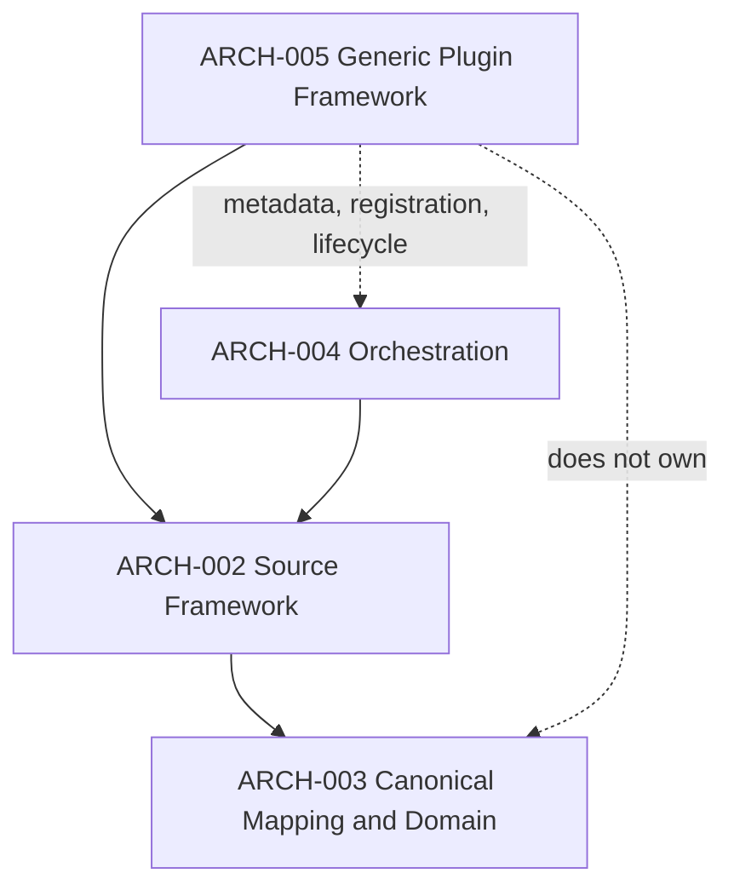
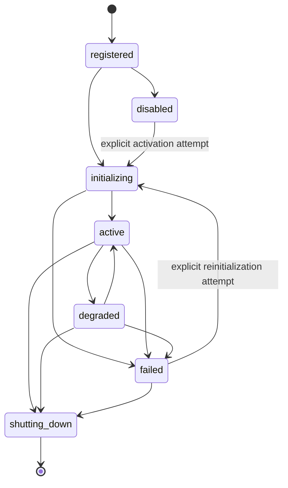

# ARCH-005 - Generic Plugin Framework

**Document ID:** ARCH-005  
**Project:** CarHunter v3  
**Status:** Draft 1.0  
**Scope Type:** Architecture Definition  
**Depends on:** [docs/ARCHITECTURE.md](../ARCHITECTURE.md), [ARCH-002-Source-Framework.md](./ARCH-002-Source-Framework.md), [ARCH-003-Canonical-Car-Domain-Model.md](./ARCH-003-Canonical-Car-Domain-Model.md), [ARCH-004-Pipeline-and-Orchestration.md](./ARCH-004-Pipeline-and-Orchestration.md)

## Table of Contents

- [1. Executive Summary](#1-executive-summary)
- [2. Purpose and Scope](#2-purpose-and-scope)
- [3. Relationship to ARCH-001 / ARCH-002 / ARCH-003 / ARCH-004](#3-relationship-to-arch-001--arch-002--arch-003--arch-004)
- [4. Definition of a Plugin in CarHunter](#4-definition-of-a-plugin-in-carhunter)
- [5. Plugin Families and Ownership](#5-plugin-families-and-ownership)
- [6. Generic Plugin Metadata Contract](#6-generic-plugin-metadata-contract)
- [7. Registration and Registry Model](#7-registration-and-registry-model)
- [8. Configuration and Enablement](#8-configuration-and-enablement)
- [9. Initialization, Health and Shutdown Lifecycle](#9-initialization-health-and-shutdown-lifecycle)
- [10. Error and Compatibility Model](#10-error-and-compatibility-model)
- [11. Security and Trust Boundaries](#11-security-and-trust-boundaries)
- [12. Observability and Operational Metadata](#12-observability-and-operational-metadata)
- [13. v3.0 Required Behavior](#13-v30-required-behavior)
- [14. Future Evolution](#14-future-evolution)
- [15. Non-Goals](#15-non-goals)
- [16. Open Questions](#16-open-questions)
- [17. Summary](#17-summary)

## 1. Executive Summary

ARCH-005 defines the **generic plugin substrate** for CarHunter v3.

This document standardizes:

- plugin identity and metadata
- plugin families
- registration and loading conventions
- configuration and enablement rules
- initialization, health, readiness, and shutdown lifecycle
- compatibility and versioning expectations
- common plugin-level error categories
- trust, security, and observability requirements

ARCH-005 does **not** redefine source semantics, canonical domain semantics, or orchestration semantics. Those remain the responsibility of [ARCH-002-Source-Framework.md](./ARCH-002-Source-Framework.md), [ARCH-003-Canonical-Car-Domain-Model.md](./ARCH-003-Canonical-Car-Domain-Model.md), and [ARCH-004-Pipeline-and-Orchestration.md](./ARCH-004-Pipeline-and-Orchestration.md).

## 2. Purpose and Scope

### 2.1 ARCHITECTURAL DECISION

The purpose of ARCH-005 is to define the **infrastructure contract** for extensibility in CarHunter.

ARCH-005 defines:

- what a plugin is
- how a plugin is described
- how a plugin is registered and loaded
- how a plugin is configured and enabled
- how plugin lifecycle state is managed
- how plugin compatibility is evaluated
- how plugin health and observability are exposed

### 2.2 ARCHITECTURAL DECISION

ARCH-005 is a **generic infrastructure document**. It is not:

- a source framework
- a domain model
- an orchestration engine

### 2.3 In Scope

- generic plugin metadata
- plugin family classification
- generic registry conventions
- loading and activation conventions
- common lifecycle rules
- common error categories
- trust and security constraints
- observability metadata common across plugin families

### 2.4 Out of Scope

- `SourceAdapter` semantics
- `SourceRegistry` semantics
- `SourceDescriptor`
- `SourceCapabilities`
- `SourceContext`
- `SourceSnapshot`
- source-specific retry, throttling, and rate-limit behavior
- Vehicle / Listing / Observation semantics
- canonical identity and matching semantics
- pipeline stage ordering
- run identity and lifecycle
- orchestration locking, concurrency, retry, rerun, or resume semantics
- compatibility projection policy for `cars`

## 3. Relationship to ARCH-001 / ARCH-002 / ARCH-003 / ARCH-004

### 3.1 CURRENT FACT

The approved baseline already assumes source-side pluginization in [docs/ARCHITECTURE.md](../ARCHITECTURE.md), including a “Source Plugin Framework” and registry-configured source loading.

### 3.2 ARCHITECTURAL DECISION

ARCH-001 owns the system-wide architecture:

- platform structure
- subsystem decomposition
- top-level runtime flow
- strategic extensibility direction

### 3.3 ARCHITECTURAL DECISION

ARCH-002 owns the **Source Framework** and all source-family semantics, including:

- `SourceAdapter`
- `SourceRegistry`
- `SourceDescriptor`
- `SourceCapabilities`
- `SourceContext`
- `SourceSnapshot`
- source request, retry, health, and rate-limit rules

ARCH-005 must not redefine any source-family contract owned by ARCH-002.

### 3.4 ARCHITECTURAL DECISION

ARCH-003 owns the canonical domain boundary after `SourceSnapshot`, including:

- canonical mapping semantics
- Vehicle / Listing / Observation ownership
- canonical identity and match semantics
- provenance and enrichment ownership in the canonical domain

ARCH-005 must not redefine domain entities or canonical business rules.

### 3.5 ARCHITECTURAL DECISION

ARCH-004 owns runtime orchestration, including:

- execution modes
- stage ordering
- run identity
- run outcomes
- locking and concurrency rules
- retry / rerun / resume orchestration semantics
- pipeline telemetry boundaries

ARCH-005 must not become a second orchestration engine.

### 3.6 ARCHITECTURAL DECISION

The explicit architectural layering is:

```text
Generic Plugin Framework
    -> family-specific plugin contract
    -> family-specific runtime behavior
```

### 3.7 ARCHITECTURAL DECISION

For source plugins, the approved boundary is:

```text
ARCH-005 generic substrate
    -> ARCH-002 SourceAdapter / SourceRegistry
    -> SourceSnapshot
    -> ARCH-003 canonical mapping
```

### 3.8 Boundary View



## 4. Definition of a Plugin in CarHunter

### 4.1 CURRENT FACT

The current implementation does not have a generic plugin framework. The repository currently relies on direct module imports and static wiring in files such as:

- [scraper.py](../../scraper.py)
- [descriptions.py](../../descriptions.py)
- [options.py](../../options.py)
- [scoring.py](../../scoring.py)
- [telegram.py](../../telegram.py)
- [orchestration.py](../../orchestration.py)

### 4.2 CURRENT FACT

[register_stage](../../orchestration.py#L51) and [PIPELINE_MODES](../../orchestration.py#L64) provide a stage-registration mechanism for orchestration, but that mechanism is orchestration-specific and is not a generic plugin substrate.

### 4.3 ARCHITECTURAL DECISION

In CarHunter, a **plugin** is a packaged application extension unit that:

- belongs to a declared plugin family
- exposes explicit metadata
- is registered through a family-owned registry
- is enabled or disabled by application configuration
- participates in a defined lifecycle
- executes only through the family-specific contract owned by the relevant architecture document

### 4.4 ARCHITECTURAL DECISION

A plugin is not defined by a universal `run()` or `execute()` interface.

Family-specific execution contracts remain family-owned:

- source execution contract -> ARCH-002
- pipeline stage execution contract -> ARCH-004
- domain semantics -> ARCH-003

### 4.5 CURRENT LIMITATION

Current code paths couple integration behavior directly to module names and imports, which prevents consistent metadata, lifecycle, and compatibility handling across plugin families.

## 5. Plugin Families and Ownership

### 5.1 ARCHITECTURAL DECISION

Every plugin belongs to exactly one **plugin family**.

The plugin family determines:

- the owning architecture document
- the family-specific contract
- the runtime that invokes the plugin
- any family-specific capability vocabulary

### 5.2 ARCHITECTURAL DECISION

The approved family ownership model is:

| Plugin family | Example purpose | Family contract owner | Runtime owner | v3.0 status |
|---|---|---|---|---|
| `source` | vehicle/listing acquisition | ARCH-002 | ARCH-004 invokes via source framework | Required |
| `enrichment_provider` | external enrichment providers | family contract deferred | ARCH-004 if invoked in pipeline | Future evolution |
| `notification_channel` | outbound alert delivery channels | family contract deferred | ARCH-004 notification stages | Future evolution |

### 5.3 ARCHITECTURAL DECISION

The first concrete plugin family in CarHunter v3.0 is the **source** family.

ARCH-005 provides the generic substrate for that family, but ARCH-002 remains authoritative for source semantics and source registry behavior.

### 5.4 ARCHITECTURAL DECISION

The following do **not** become plugin families in v3.0:

- scoring logic
- canonical matching / identity logic
- storage engine selection
- reporting views

These remain core application concerns unless a later architecture document explicitly changes that decision.

### 5.5 FUTURE DESIGN

Additional plugin families may be introduced later only when they have:

- a stable family-specific contract
- clear operational value
- a runtime owner
- a real need for multiple interchangeable implementations

## 6. Generic Plugin Metadata Contract

### 6.1 ARCHITECTURAL DECISION

Every plugin must expose a **static PluginDescriptor** and participate in a **runtime PluginRegistration / PluginState** record.

### 6.2 ARCHITECTURAL DECISION

These are distinct conceptual records:

1. **PluginDescriptor**  
   Stable identity and contract metadata for the plugin implementation.
2. **PluginRegistration / PluginState**  
   Runtime registration, enablement, lifecycle, health, and diagnostics state owned by the family registry/runtime.

### 6.3 ARCHITECTURAL DECISION

The minimum `PluginDescriptor` fields are:

| Field | Meaning | Required |
|---|---|---|
| `plugin_id` | stable unique plugin identifier within its family | Yes |
| `plugin_family` | family/category classification | Yes |
| `plugin_version` | plugin implementation version | Yes |
| `contract_version` | version of the family contract the plugin implements | Yes |
| `display_name` | human-readable name | Yes |
| `capabilities` | declared family-specific capabilities | Yes |
| `configuration_contract` | validation contract for configuration input | Yes |
| `dependencies` | declared prerequisites or companion plugins | Yes |
| `optional_capabilities` | additional non-required capabilities | No |

### 6.4 ARCHITECTURAL DECISION

The static `PluginDescriptor` must not contain mutable operational state.

The following do **not** belong in the static descriptor:

- `enabled_state`
- `health_state`
- lifecycle state
- blocked reason
- readiness state
- degraded status
- runtime diagnostics

### 6.5 ARCHITECTURAL DECISION

The runtime `PluginRegistration / PluginState` record owns mutable operational state, including:

- `enabled_state`
- `health_state`
- lifecycle state
- blocked reason
- readiness/degraded status
- runtime diagnostics and observability state where required by the family runtime

### 6.6 ARCHITECTURAL DECISION

`plugin_id` must be:

- stable across releases unless intentionally deprecated/replaced
- unique within its plugin family
- suitable for configuration, logs, and diagnostics

### 6.7 ARCHITECTURAL DECISION

`contract_version` is the compatibility boundary between ARCH-005 infrastructure and the family-specific contract.

It identifies **which family contract version** the plugin implements. It does not replace the architecture document that defines that family contract.

### 6.8 ARCHITECTURAL DECISION

`capabilities` and `optional_capabilities` are family-specific vocabularies interpreted by the family owner.

ARCH-005 defines how capabilities are declared and surfaced, but not what a source capability or enrichment capability means.

### 6.9 ARCHITECTURAL DECISION

Compatibility validation operates on both records, but at different layers:

- the `PluginDescriptor` is validated for structural identity and contract metadata
- the `PluginRegistration / PluginState` record is evaluated for runtime enablement, health, blocked state, and readiness

### 6.10 ARCHITECTURAL DECISION

The generic descriptor must be machine-readable at registration time without requiring the plugin to perform external work first.

### 6.11 CURRENT LIMITATION

The current implementation does not expose a generic plugin descriptor model. Metadata is implicit in module names, functions, and hardcoded imports.

## 7. Registration and Registry Model

### 7.1 CURRENT FACT

Current v3.0-dev wiring is mostly static:

- orchestration imports stage modules directly in [orchestration.py](../../orchestration.py)
- source acquisition is hardcoded through [scraper.py](../../scraper.py)
- notification delivery is hardcoded through [telegram.py](../../telegram.py)

### 7.2 ARCHITECTURAL DECISION

The v3.0 plugin registration model is:

- explicit/static Python registration
- explicit registry objects
- configuration-driven enable/disable
- optional capability-based selection

### 7.3 ARCHITECTURAL DECISION

Registries are **family-owned**. CarHunter v3.0 does not introduce one giant global plugin manager.

Examples:

- `SourceRegistry` remains owned by ARCH-002
- a future notification registry would be owned by the notification family contract, not by orchestration itself

### 7.4 ARCHITECTURAL DECISION

ARCH-005 defines common registry conventions only:

- registration is explicit
- `PluginDescriptor` validation occurs before activation
- duplicate `plugin_id` values within a family are rejected
- incompatible `contract_version` values are rejected
- disabled plugins remain visible to diagnostics through runtime registration state but are not activated
- registry lookup may support capability-based filtering when the family contract allows it

### 7.5 ARCHITECTURAL DECISION

Dynamic discovery mechanisms are **not** v3.0 requirements.

The following are explicitly deferred:

- package entry-point loading
- arbitrary filesystem module scanning
- runtime remote plugin installation
- remote code download
- heavy dependency-injection containers

### 7.6 ARCHITECTURAL DECISION

This minimal model is required because current CarHunter requirements are narrow:

- one concrete family is required now
- current codebase is static and in-repository
- deterministic startup and diagnostics are more important than broad extension machinery

### 7.7 MIGRATION PRINCIPLE

Family-owned registries may share common infrastructure helpers later, but the family boundary remains explicit even if implementation utilities are reused.

## 8. Configuration and Enablement

### 8.1 CURRENT FACT

Current configuration is static and module-level in [config.py](../../config.py), with additional environment-based settings used by integrations such as [telegram.py](../../telegram.py).

### 8.2 ARCHITECTURAL DECISION

A plugin must not be activated until:

1. `PluginDescriptor` metadata is registered
2. configuration is present
3. configuration is validated against the plugin's `configuration_contract`
4. dependencies and prerequisites are satisfied
5. compatibility checks pass

### 8.3 ARCHITECTURAL DECISION

Enablement is configuration-driven and is represented in runtime `PluginRegistration / PluginState`, not in the static `PluginDescriptor`.

The framework recognizes these enablement outcomes:

- `enabled`
- `disabled`
- `incompatible`
- `blocked`

### 8.4 ARCHITECTURAL DECISION

`blocked` means a plugin is known, registered, and configured for use, but activation is prevented by unmet prerequisites, missing dependencies, or failed initialization.

### 8.5 ARCHITECTURAL DECISION

A disabled plugin must not be silently activated by orchestration, CLI dispatch, or any plugin registry default behavior.

### 8.6 CURRENT LIMITATION

Current integration modules do not expose a shared configuration-validation contract or shared enablement-state model.

## 9. Initialization, Health and Shutdown Lifecycle

### 9.1 ARCHITECTURAL DECISION

The normative generic plugin lifecycle is:

```text
registered
    -> disabled
    or
    -> initializing
    -> active
    -> degraded
    or
    -> failed
    -> shutting_down
```

### 9.2 Lifecycle View



### 9.3 ARCHITECTURAL DECISION

Lifecycle semantics are:

- **registered**: metadata has been accepted by the family registry
- **disabled**: plugin is intentionally not activated
- **initializing**: plugin is validating config, dependencies, and startup prerequisites
- **active**: plugin is healthy enough to participate in its family runtime
- **degraded**: plugin remains present but has reduced availability or capability
- **failed**: plugin cannot satisfy the family contract for the current runtime state
- **shutting_down**: plugin is releasing resources and stopping cleanly

### 9.4 ARCHITECTURAL DECISION

Health and readiness are distinct from mere registration.

A registered plugin is not considered available to its owning runtime until it reaches `active` or, where the family contract explicitly allows it, a family-approved `degraded` state.

### 9.5 ARCHITECTURAL DECISION

`disabled -> initializing` is allowed only through an explicit fresh activation attempt by the owning registry/runtime.

`failed -> initializing` is allowed only through an explicit fresh activation or reinitialization attempt by the owning registry/runtime.

This is lifecycle management, not retry policy.

### 9.6 ARCHITECTURAL DECISION

Lifecycle recovery in ARCH-005 does not redefine retry ownership:

- source retry remains owned by ARCH-002
- stage retry / rerun / resume remains owned by ARCH-004

ARCH-005 must not become a retry engine.

### 9.7 ARCHITECTURAL DECISION

Initialization may perform:

- configuration validation
- compatibility checks
- dependency resolution against already-registered family components
- setup of external client objects or local resources

Initialization must not assume ownership of scheduler behavior, run state, or orchestration ordering.

### 9.8 ARCHITECTURAL DECISION

Shutdown must be explicit when a plugin family manages resources that require cleanup.

The framework does not require every plugin family to hold long-lived resources, but it requires every family contract to define whether shutdown work exists.

### 9.9 CURRENT LIMITATION

The current codebase has no shared plugin lifecycle state model. Directly imported modules are invoked without generic registration, readiness, or shutdown handling.

## 10. Error and Compatibility Model

### 10.1 CURRENT FACT

Current integration error handling is module-specific and inconsistent. Examples include:

- request soft-fail behavior in [scraper.http_get](../../scraper.py#L72)
- integration-specific exception handling in [telegram.py](../../telegram.py)
- ad hoc initialization and execution coupling across source, repair, and notification code

### 10.2 ARCHITECTURAL DECISION

ARCH-005 defines the following common plugin-level error categories:

| Error category | Meaning |
|---|---|
| `configuration_error` | required configuration is missing, malformed, or invalid |
| `compatibility_error` | plugin metadata or contract version is incompatible with the runtime or family contract |
| `initialization_error` | plugin could not become ready during initialization |
| `unavailable_error` | plugin dependency or external dependency is unavailable |
| `degraded_error` | plugin remains present but cannot provide full behavior |
| `contract_violation` | plugin behavior does not satisfy the family contract |
| `execution_error` | plugin execution failed after successful activation |

### 10.3 ARCHITECTURAL DECISION

ARCH-005 owns plugin compatibility classification only at the infrastructure layer:

- `PluginDescriptor` metadata compatibility
- contract-version compatibility
- registration-time validation
- initialization-time compatibility checks over runtime registration state

ARCH-005 does not define family-specific semantic compatibility rules such as source capability meaning or canonical field semantics.

### 10.4 ARCHITECTURAL DECISION

ARCH-005 does **not** own retry policy.

- source retry belongs to ARCH-002
- stage retry / rerun / resume belongs to ARCH-004

### 10.5 ARCHITECTURAL DECISION

A plugin must never become its own scheduler, run manager, or retry engine.

### 10.6 CURRENT LIMITATION

The current implementation has no shared compatibility/version contract across integration points.

## 11. Security and Trust Boundaries

### 11.1 ARCHITECTURAL DECISION

For v3.0, CarHunter assumes **trusted in-repository plugins** only.

### 11.2 ARCHITECTURAL DECISION

The following are explicitly out of scope for v3.0:

- arbitrary third-party plugin packages
- unsigned remote plugin installation
- runtime code download
- remote plugin execution

### 11.3 ARCHITECTURAL DECISION

Every plugin must expose:

- explicit plugin identity
- explicit version
- declared family
- declared dependencies/prerequisites
- declared external side effects or external service dependencies

Static identity and declared dependency metadata belong to `PluginDescriptor`. Runtime trust and health outcomes belong to `PluginRegistration / PluginState`.

### 11.4 ARCHITECTURAL DECISION

Secrets must be supplied by application configuration or environment, not encoded in plugin descriptors or plugin source metadata.

### 11.5 ARCHITECTURAL DECISION

A plugin family contract may impose stricter trust rules, but it must not weaken the generic trust boundary defined here.

### 11.6 CURRENT LIMITATION

Current integrations such as [telegram.py](../../telegram.py) rely on direct environment access without a generic plugin security model.

## 12. Observability and Operational Metadata

### 12.1 CURRENT FACT

ARCH-004 defines run and stage telemetry, but the current codebase does not attach generic plugin metadata to those operational records.

### 12.2 ARCHITECTURAL DECISION

The minimum plugin observability metadata is:

- `plugin_family`
- `plugin_id`
- `plugin_version`
- `contract_version`
- `capability_set`
- `health_state`

### 12.3 ARCHITECTURAL DECISION

Observability attaches static identity from `PluginDescriptor` and dynamic health/lifecycle state from `PluginRegistration / PluginState`.

### 12.4 ARCHITECTURAL DECISION

When a plugin participates in a runtime owned by another architecture layer, correlation context is supplied by that owning layer.

Examples:

- source plugin execution receives source/runtime context via ARCH-002
- run and stage correlation context comes from ARCH-004

### 12.5 ARCHITECTURAL DECISION

ARCH-005 observability complements rather than replaces ARCH-004 run/stage telemetry.

### 12.6 FUTURE DESIGN

Future operational views may combine:

- plugin registry state
- plugin health summaries
- plugin compatibility warnings
- run/stage telemetry from ARCH-004

## 13. v3.0 Required Behavior

### 13.1 ARCHITECTURAL DECISION

The v3.0 required ARCH-005 baseline is intentionally small.

It requires:

- a generic plugin definition
- a generic metadata descriptor
- family-owned registries under shared conventions
- configuration-driven enablement
- a common lifecycle vocabulary
- common compatibility/error categories
- trust/security boundaries
- minimum observability metadata

### 13.2 ARCHITECTURAL DECISION

v3.0 requires source plugin support as the first concrete family, but the source family contract remains owned by [ARCH-002-Source-Framework.md](./ARCH-002-Source-Framework.md).

### 13.3 MIGRATION PRINCIPLE

CarHunter may adopt ARCH-005 infrastructure incrementally.

The first migration target is replacing direct source-specific imports with the source-family abstractions already defined by ARCH-002, while preserving the orchestration and compatibility rules defined by ARCH-004.

### 13.4 CURRENT LIMITATION

The current repository does not yet implement the generic metadata, lifecycle, or registry substrate defined here.

## 14. Future Evolution

### 14.1 FUTURE DESIGN

Future evolution may add additional plugin families only when they are justified by multiple implementations and a stable family contract.

Likely future candidates are:

- enrichment provider plugins
- notification channel plugins

### 14.2 FUTURE DESIGN

Future evolution may also add:

- richer capability-based selection
- family-specific health dashboards
- reusable registry/helper infrastructure shared across families

### 14.3 FUTURE DESIGN

Dynamic discovery mechanisms may be introduced later only if independently distributed plugin packages become necessary. Such a change requires an explicit architecture revision because it changes trust, packaging, and operational complexity.

## 15. Non-Goals

### 15.1 ARCHITECTURAL DECISION

ARCH-005 does not define:

- source acquisition semantics
- source identity semantics
- source provenance semantics
- source retry/throttling policy
- canonical Vehicle / Listing / Observation definitions
- canonical identity and match policy
- pipeline stage ordering
- run identity
- orchestration locking/concurrency
- orchestration retry/rerun/resume semantics
- `cars` compatibility projection policy
- scoring pluginization
- matching/identity pluginization
- storage pluginization
- reporting pluginization

## 16. Open Questions

### 16.1 OPEN QUESTION

Should CarHunter standardize one reusable registry helper library across families, or keep only shared conventions while each family implements its own registry internals?

### 16.2 OPEN QUESTION

After the source family, which future family provides the next highest architectural value: enrichment providers or notification channels?

### 16.3 OPEN QUESTION

Should `contract_version` be managed purely per-family, or should CarHunter also publish a cross-family framework version for diagnostics and release management?

## 17. Summary

### 17.1 ARCHITECTURAL DECISION

ARCH-005 defines the generic plugin substrate for CarHunter v3.

### 17.2 ARCHITECTURAL DECISION

It standardizes plugin metadata, registration, lifecycle, compatibility, trust, and observability without redefining source, domain, or orchestration ownership.

### 17.3 MIGRATION PRINCIPLE

The document keeps the framework intentionally small: family-owned contracts remain authoritative, and the generic substrate exists to support them rather than replace them.
