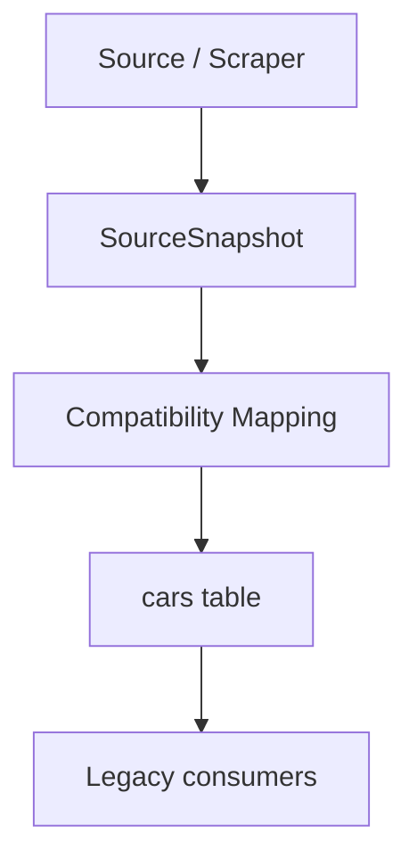
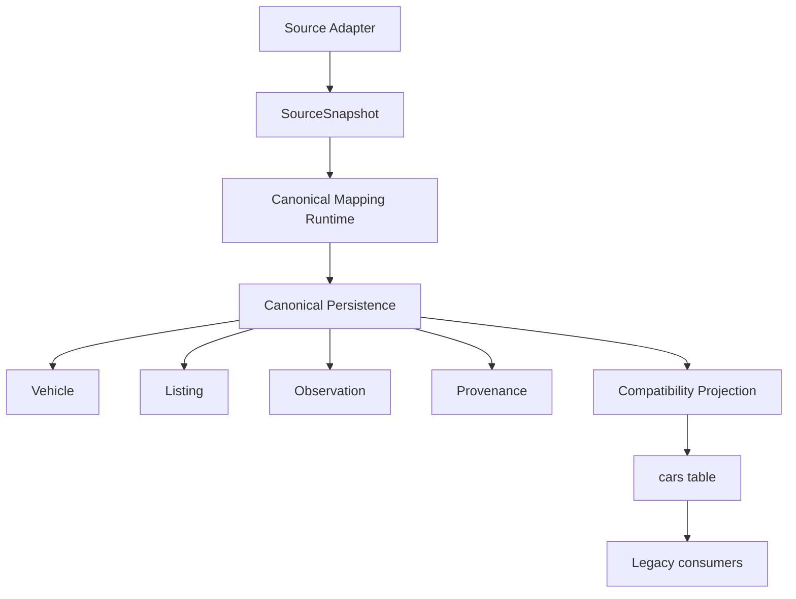
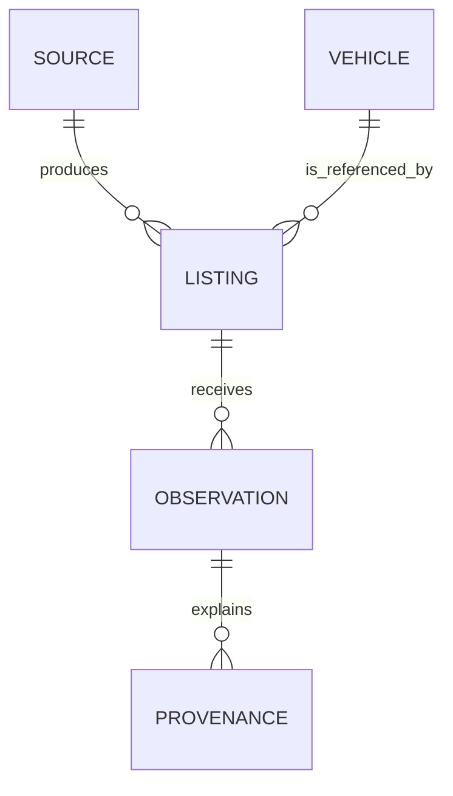
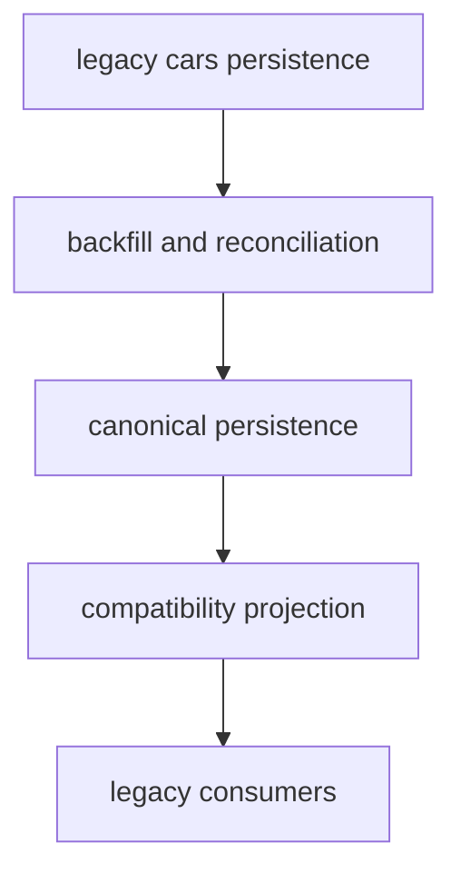

# ARCH-007 – Canonical Persistence and Mapping Runtime

**Document ID:** ARCH-007  
**Project:** CarHunter v3  
**Status:** Draft 1.0  
**Scope Type:** Architecture Definition  
**Depends on:** [docs/ARCHITECTURE.md](../ARCHITECTURE.md), [ARCH-002-Source-Framework.md](./ARCH-002-Source-Framework.md), [ARCH-003-Canonical-Car-Domain-Model.md](./ARCH-003-Canonical-Car-Domain-Model.md), [ARCH-004-Pipeline-and-Orchestration.md](./ARCH-004-Pipeline-and-Orchestration.md), [ARCH-005-Generic-Plugin-Framework.md](./ARCH-005-Generic-Plugin-Framework.md)  
**Related Baseline:** current merged `origin/v3.0-dev` implementation

## Table of Contents

- [1. Executive Summary](#1-executive-summary)
- [2. Purpose and Scope](#2-purpose-and-scope)
- [3. Relationship to ARCH-002 through ARCH-006](#3-relationship-to-arch-002-through-arch-006)
- [4. Current-State Baseline](#4-current-state-baseline)
- [5. Target Architecture](#5-target-architecture)
- [6. Canonical Persistence Architecture](#6-canonical-persistence-architecture)
- [7. Source-to-Canonical Mapping Runtime](#7-source-to-canonical-mapping-runtime)
- [8. Identity and Deduplication](#8-identity-and-deduplication)
- [9. Observation and History Model](#9-observation-and-history-model)
- [10. Provenance Model](#10-provenance-model)
- [11. Transactions, Atomicity, and Failure Handling](#11-transactions-atomicity-and-failure-handling)
- [12. Compatibility Projection and Legacy Consumers](#12-compatibility-projection-and-legacy-consumers)
- [13. Migration Strategy](#13-migration-strategy)
- [14. Concurrency and Idempotency](#14-concurrency-and-idempotency)
- [15. Data Quality Boundaries](#15-data-quality-boundaries)
- [16. Current vs Target vs Migration](#16-current-vs-target-vs-migration)
- [17. Architectural Boundaries and Non-Goals](#17-architectural-boundaries-and-non-goals)
- [18. Diagrams](#18-diagrams)
- [19. Open Architectural Questions](#19-open-architectural-questions)
- [20. Summary](#20-summary)

## 1. Executive Summary

ARCH-007 defines the runtime boundary between source acquisition and durable canonical domain state. It does not redesign source acquisition, orchestration, scoring, watchlist, notification, or UI behavior. Its purpose is to make the transition from source-owned data to canonical state explicit, deterministic, and safe.

The current merged baseline still routes source data into a compatibility-shaped persistence model centered on the legacy `cars` table. That model is sufficient for the current runtime, but it is not the canonical domain model. ARCH-007 establishes the architectural contract for moving from that current state to a canonical persistence layer that can support Vehicle, Listing, Source, Observation, and Provenance as first-class concepts.

ARCH-007 is therefore the bridge between:

```text
SourceSnapshot
    -> canonical mapping
    -> canonical domain state
    -> compatibility projection
    -> legacy consumers
```

This document defines how that bridge behaves, what it owns, what it does not own, and how the system migrates without breaking the existing runtime.

## 2. Purpose and Scope

### 2.1 Purpose

The purpose of ARCH-007 is to define the explicit runtime and persistence boundary for canonical domain state.

ARCH-007 defines:

- how canonical entities become persistent state
- how source data is mapped into canonical entities
- how identity and deduplication are handled
- how observations and history are preserved
- how provenance is retained at the canonical boundary
- how compatibility projection remains operational during migration

### 2.2 In Scope

- canonical persistence for Vehicle, Listing, Source, Observation, and Provenance
- source-to-canonical mapping semantics after [SourceSnapshot](./ARCH-002-Source-Framework.md)
- deterministic identity and deduplication rules
- append-only observation semantics and change detection
- provenance persistence at the canonical boundary
- transaction boundaries between canonical state and compatibility projection
- migration from the current `cars`-centered persistence path
- failure handling, idempotency, and recoverability

### 2.3 Out of Scope

- source discovery, fetch, retry, and rate-limit policy
- plugin loading or plugin lifecycle orchestration
- scoring, recommendation, watchlist, notification, or UI redesign
- replacement of the legacy downstream runtime in one step
- a complete rewrite of the legacy database layer

## 3. Relationship to ARCH-002 through ARCH-006

### 3.1 Ownership Boundary

The boundary between the architecture documents is:

| Architecture | Owns | Does not own |
|---|---|---|
| ARCH-002 | source acquisition semantics, source adapters, `SourceSnapshot`, source-level provenance | canonical domain meaning |
| ARCH-003 | canonical domain meaning, Vehicle/Listing/Observation semantics | source acquisition |
| ARCH-004 | pipeline execution, stage ordering, run lifecycle, retry orchestration semantics | canonical persistence design |
| ARCH-005 | generic plugin infrastructure and metadata | family-specific semantics |
| ARCH-006 | first concrete source plugin family bootstrap | canonical persistence redesign |
| ARCH-007 | canonical persistence, mapping runtime, identity, observation persistence, provenance persistence, compatibility projection | source adapter contracts, scoring, recommendation, watchlist, notification, UI |

### 3.2 Architectural Layering

The approved layering is:

```text
ARCH-002 Source Framework
    -> SourceSnapshot
    -> ARCH-007 canonical mapping runtime
    -> canonical persistence
    -> compatibility projection
    -> legacy consumers
```

ARCH-007 is the first architecture layer that defines the durable persistence contract after source acquisition has produced a source-owned handoff.

## 4. Current-State Baseline

### 4.1 CURRENT STATE

The current merged baseline still uses a compatibility-shaped persistence model centered on the `cars` table in [database.py](../../database.py). The current runtime path is:

```text
orchestration.stage_scrape
    -> SourceIngestionService
    -> SourceSnapshot
    -> source_compatibility.apply_compatibility_inventory_updates
    -> database.save_car / database.mark_missing_cars_sold
    -> cars table
    -> downstream consumers
```

### 4.2 CURRENT STATE

The current implementation makes the following architectural assumptions:

- a single row in `cars` represents the current state of a listing-like entity
- source identity is implicit in the scrape path and URL structure
- the legacy `fingerprint` field is used as a heuristic matching key
- source observations are overwritten into the same row rather than preserved as history
- downstream modules such as scoring, deal assessment, repair, data quality, watchlist, reporting, and web access continue to read directly from the compatibility model

### 4.3 CURRENT STATE

The current implementation evidence is visible in:

- [sources/base.py](../../sources/base.py) for the new source boundary
- [sources/service.py](../../sources/service.py) for the ingestion service
- [sources/autoscout24.py](../../sources/autoscout24.py) for the first source adapter
- [source_compatibility.py](../../source_compatibility.py) for the compatibility bridge
- [orchestration.py](../../orchestration.py) for the scrape-stage integration
- [scraper.py](../../scraper.py) for the current normalization path
- [database.py](../../database.py) for the legacy `cars` table persistence and mutation model
- [models.py](../../models.py) for the legacy row-based projection

### 4.4 CURRENT LIMITATION

The current implementation contains the source boundary required by ARCH-002 and ARCH-006, but it does not yet provide an explicit canonical persistence boundary. The system still collapses source-observed facts into a single compatibility row.

## 5. Target Architecture

### 5.1 TARGET ARCHITECTURE

ARCH-007 defines a target runtime shape in which:

1. source acquisition produces `SourceSnapshot`
2. a canonical mapping runtime converts that source-owned handoff into canonical entities
3. canonical entities are persisted as durable canonical state
4. a compatibility projection continues to serve legacy consumers until they are migrated

### 5.2 TARGET RUNTIME SHAPE

```text
SourceSnapshot
    -> Mapping Runtime
    -> Canonical Persistence
        -> Vehicle
        -> Listing
        -> Source
        -> Observation
        -> Provenance
    -> Compatibility Projection
        -> cars
    -> Legacy Consumers
```

### 5.3 TARGET ARCHITECTURE PRINCIPLE

Canonical persistence is authoritative for canonical meaning. The compatibility projection is a service projection for legacy consumers and is never allowed to become the canonical source of truth.

## 6. Canonical Persistence Architecture

### 6.1 Canonical Concepts

ARCH-007 defines the following canonical persistent concepts:

- Vehicle: the canonical identity root for the physical vehicle
- Listing: a source-specific marketplace listing that may refer to a Vehicle
- Source: the stable source identity that produced the listing
- Observation: a time-bound record of what a source reported at a specific point in time
- Provenance: metadata that explains how a canonical fact entered the system and how it was transformed

These concepts are the only canonical persistence concepts that ARCH-007 defines. No additional domain entities are introduced for the initial architecture.

### 6.2 Persistence Ownership

The canonical persistence layer owns the durable lifecycle of these concepts.

| Canonical concept | Persistence responsibility | Notes |
|---|---|---|
| Vehicle | create, update, link to listings, preserve canonical stable facts | not equivalent to a listing |
| Listing | represent a specific source listing, own source identity and listing continuity | not equivalent to a vehicle |
| Source | represent a stable source reference | source identity is not derived from a URL |
| Observation | preserve append-only historical observations | repeated identical observations do not create new canonical history |
| Provenance | preserve mapping lineage and field-level or record-level attribution | provenance is retained even if the canonical field is later overwritten |

### 6.3 Canonical State Boundary

The canonical persistence layer MUST maintain a clear separation between:

- canonical truth
- source ownership
- compatibility projection

Canonical persistence MUST NOT absorb downstream application concerns such as scoring, recommendation, or notification state. Those remain external to ARCH-007.

### 6.4 Transactional Unit of Canonical Write

For a single mapping result, the canonical persistence layer MUST commit a coherent write set for the entities involved. The canonical write set is the minimum unit necessary to make the mapping durable and consistent.

A canonical write MAY involve:

- one Vehicle record
- one Listing record
- one or more Observation records
- one or more Provenance records

The canonical transaction MUST be atomic as a unit. If any required canonical write fails, the canonical transaction MUST fail and leave no partial canonical state for that mapping result.

## 7. Source-to-Canonical Mapping Runtime

### 7.1 Boundary

The source-to-canonical mapping runtime owns the boundary between `SourceSnapshot` and canonical persistent state.

It MUST:

- receive source-owned data through `SourceSnapshot`
- interpret the source data according to canonical semantics
- create or update canonical entities
- preserve a durable record of the mapping and source context
- hand off the resulting canonical state to the compatibility projection layer

It MUST NOT:

- redefine source acquisition behavior
- redefine pipeline orchestration behavior
- own scoring or recommendation decisions
- silently collapse source and canonical identity semantics

### 7.2 Mapping Responsibilities

The mapping runtime MUST explicitly decide:

- whether the incoming data corresponds to an existing Vehicle
- whether it corresponds to an existing Listing
- whether the current observation is new or duplicate
- whether the mapping is confident or unresolved
- how to preserve source facts and source-local identifiers
- how to update canonical state when a listing changes

### 7.3 Mapping Outcomes

For each incoming observation, the mapping runtime MUST produce one of the following outcomes:

1. New canonical Vehicle and Listing
2. Existing Vehicle, new Listing
3. Existing Listing, new Observation
4. Existing Listing, duplicate observation
5. Unresolved identity, provisional canonical state

If the mapping runtime cannot confidently identify a Vehicle or Listing, it MUST NOT silently merge data into an unrelated entity. It MUST either:

- create a provisional canonical entity with explicit unresolved status, or
- keep the mapping pending until a later reconciliation step resolves identity

### 7.4 Handling Incomplete or Conflicting Data

The mapping runtime MUST define explicit behavior for incomplete and conflicting data:

- incomplete data MUST NOT be treated as a successful full canonical update
- partial data MUST be persisted as an observation only when the underlying source fact is valid and the mapping outcome is clear
- conflicting data MUST be preserved as a new observation and linked to provenance rather than overwriting prior canonical state without an explicit conflict policy

## 8. Identity and Deduplication

### 8.1 Architectural Decision

Canonical identity MUST be separated from source-local identity.

The canonical model MUST distinguish:

- Vehicle identity
- Listing identity
- Source identity
- source-local listing identifier

### 8.2 Identity Evidence Classification

The authoritative identity decision MUST use the following evidence classes.

| Class | Evidence | Use |
|---|---|---|
| A. AUTHORITATIVE IDENTITY | valid VIN; valid registration or license identifier when available; stable source-local vehicle identifier when provided by a source and recognized by the source contract | MUST be used for deterministic matching when present and valid |
| B. STRONG MATCH EVIDENCE | normalized make/model/model-generation; model year; body style; engine/powertrain; normalized technical identity; existing canonical links to known listings for the same vehicle | MUST be used only when it is consistent with an existing candidate and does not contradict an authoritative identifier |
| C. SUPPORTING MATCH EVIDENCE | URL; title and description; price; mileage; source-provided listing context; legacy fingerprint | MUST NOT be used alone as canonical identity. MUST be used only as ranking or conflict evidence |
| D. NON-IDENTITY ATTRIBUTES | price; mileage; title tokens; description text; raw payload shape; transient display values | MUST NOT be used as canonical Vehicle identity |

### 8.3 Canonical Identity Normalization

The composite Vehicle identity MUST be normalized with a fixed algorithm that two independent implementers can apply without discretion. The runtime MUST apply all normalization steps in the same order for every field and MUST preserve the normalized form in the same field order.

The normalization algorithm for every string field is:

1. Unicode normalize to NFKC.
2. Trim leading and trailing whitespace.
3. Collapse all Unicode whitespace runs to one ASCII space.
4. Convert to lowercase.
5. Replace `/`, `-`, `_`, and `\\` with a single ASCII space.
6. Remove punctuation characters `. , ' " ( ) [ ] { } : ;`.
7. Collapse remaining whitespace runs to one ASCII space.
8. If the result is empty after normalization, serialize it as `NULL` rather than as an empty string.

The runtime MUST apply the following field-specific rules:

- MAKE
  - Normalize with the algorithm above.
  - No aliases are allowed.
  - The normalized value MUST be compared exactly.

- MODEL
  - Normalize with the algorithm above.
  - Hyphens, slashes, and punctuation MUST be removed as separators and MUST NOT be preserved in the canonical form.
  - No aliases are allowed.
  - The normalized value MUST be compared exactly.

- MODEL GENERATION
  - Normalize with the algorithm above.
  - The canonical value MUST be the normalized token string.
  - Missing or invalid values MUST be serialized as `NULL`.
  - No aliases are allowed.

- MODEL YEAR
  - Normalize to a four-digit integer in canonical decimal form.
  - Accepted values MUST be integers from 1900 through 2100 inclusive.
  - Invalid or missing values MUST be serialized as `NULL`.

- BODY STYLE
  - Normalize with the algorithm above.
  - The canonical vocabulary MUST be one of the following values: `cabriolet`, `coupe`, `estate`, `hatchback`, `sedan`, `suv`, `pickup`, `van`.
  - The runtime MUST map source values to that vocabulary with the following fixed mapping table:
    - `cabriolet`, `convertible`, `cabrio` -> `cabriolet`
    - `coupe`, `coupé` -> `coupe`
    - `estate`, `station wagon`, `wagon`, `touring` -> `estate`
    - `hatchback`, `hatch` -> `hatchback`
    - `sedan`, `saloon` -> `sedan`
    - `suv`, `4x4`, `offroad` -> `suv`
    - `pickup`, `pick-up`, `pickup truck` -> `pickup`
    - `van`, `mpv`, `minivan` -> `van`
  - Any source value not in the table MUST be serialized as `NULL` and MUST NOT be treated as a match.

- ENGINE / POWERTRAIN
  - The canonical engine/powertrain identity MUST be serialized in the fixed form:
    - `fuel=<normalized_fuel>|displacement_cc=<integer>|drivetrain=<normalized_drivetrain>|transmission=<normalized_transmission>`
  - Identity-bearing components are:
    - fuel
    - displacement in cubic centimeters
    - drivetrain
    - transmission
  - The runtime MUST normalize fuel to one of: `diesel`, `petrol`, `electric`, `hybrid`, `gas`.
  - The runtime MUST normalize drivetrain to one of: `fwd`, `rwd`, `awd`, `4wd`.
  - The runtime MUST normalize transmission to one of: `manual`, `automatic`, `semi_automatic`, `cvt`.
  - If any identity-bearing component is missing, unknown, or invalid, the engine/powertrain identity MUST be serialized as `NULL`.
  - Variant identifiers, trim identifiers, and other informational text MUST NOT be used as identity-bearing fields.

The runtime MUST serialize the composite identity in the fixed field order:

`make=<value>|model=<value>|model_generation=<value>|model_year=<value>|body_style=<value>|engine=<value>`

The runtime MUST compare composite identity values exactly after normalization. The runtime MUST NOT perform fuzzy matching, similarity scoring, or confidence-based matching.

### 8.4 Deterministic Vehicle Matching Rules

The mapping runtime MUST resolve Vehicle identity with a deterministic decision tree. The runtime MUST return exactly one of the following outcomes for each incoming observation:

- MATCH_EXISTING
- CREATE_NEW
- PROVISIONAL_UNRESOLVED
- OPERATOR_REVIEW

The decision order MUST be:

1. Existing Listing linkage
   - If the incoming observation matches an existing canonical Listing by `(source_id, source_local_listing_id)`, the runtime MUST reuse that Listing.
   - If that Listing already links to a canonical Vehicle and no authoritative conflict exists, the outcome MUST be MATCH_EXISTING.
   - If that Listing already links to a Vehicle but the incoming observation includes a conflicting authoritative identifier, the outcome MUST be OPERATOR_REVIEW.
   - If that Listing is unlinked, the runtime MUST attach the incoming observation to that Listing and continue to the Vehicle decision below.

2. Authoritative identity
   - If a valid VIN exists:
     - exact VIN match to exactly one existing canonical Vehicle -> MATCH_EXISTING
     - no existing canonical Vehicle with that VIN -> CREATE_NEW
     - conflicting authoritative VIN evidence -> OPERATOR_REVIEW
   - A VIN MUST NOT be ignored because other evidence exists. A valid VIN is authoritative and takes precedence over weaker evidence.
   - The runtime MUST NOT merge two Vehicles solely because a weak attribute matches when a VIN conflict exists.

3. Additional authoritative identifiers
   - If the source contract or ARCH-003 defines an additional authoritative vehicle identifier, the runtime MUST treat it as authoritative at the same precedence as VIN.
   - Matching behavior MUST be exact and deterministic:
     - exact match to one existing canonical Vehicle -> MATCH_EXISTING
     - no existing canonical Vehicle with that identifier -> CREATE_NEW
     - conflicting authoritative identifiers -> OPERATOR_REVIEW
   - For this architecture and the current source adapters, no additional authoritative identifier beyond VIN and a source-contract vehicle ID is defined. If a future source contract adds another identifier, it MUST be inserted at this step and evaluated before any composite technical identity rule.

4. Exact composite technical identity
   - If no authoritative identifier is present, the runtime MUST evaluate the normalized composite identity using the exact field order and exact normalization rules defined above.
   - If exactly one existing canonical Vehicle satisfies the normalized composite identity, the outcome MUST be MATCH_EXISTING.
   - If zero existing canonical Vehicles satisfy the normalized composite identity, the outcome MUST be CREATE_NEW.
   - If more than one existing canonical Vehicle satisfies the normalized composite identity, the outcome MUST be PROVISIONAL_UNRESOLVED.
   - The runtime MUST NOT merge multiple candidates solely because they share a subset of these fields.

5. Non-authoritative evidence
   - URL, price, mileage, title, description, source listing context, and legacy fingerprint MUST NOT resolve Vehicle identity by themselves.
   - They MUST be attached as provenance and supporting evidence, but they MUST NOT produce MATCH_EXISTING or CREATE_NEW when authoritative or composite technical identity is absent.

Precedence and conflict handling MUST be deterministic:
- The runtime MUST evaluate these steps in order and stop at the first decisive outcome.
- A higher-precedence outcome overrides lower-precedence evidence.
- If a lower-precedence evidence class conflicts with a higher-precedence match already established, the lower-precedence evidence MUST NOT change the decision; it MUST be preserved in provenance and marked as conflicting evidence.
- If the runtime cannot produce a single deterministic outcome because the evidence is incomplete or contradictory, the outcome MUST be PROVISIONAL_UNRESOLVED unless an authoritative identifier conflict exists, in which case the outcome MUST be OPERATOR_REVIEW.

### 8.5 Unresolved Identity

If the runtime returns PROVISIONAL_UNRESOLVED, it MUST:

- create or retain a provisional canonical Vehicle record with an explicit unresolved identity state
- keep the observation attached to that provisional record
- preserve the evidence and conflict metadata in provenance
- avoid merging it into an unrelated existing Vehicle record

If the runtime returns OPERATOR_REVIEW, it MUST:

- create no automatic merge
- create or retain an unresolved record only if the current implementation requires a durable placeholder
- attach the observation and all conflicting evidence to provenance
- route the record to operator review

The runtime MUST NOT treat legacy fingerprint as canonical identity. The legacy fingerprint is compatibility evidence only.

### 8.6 Listing Identity

Listing identity MUST be defined separately from Vehicle identity.

A canonical Listing MUST be identified by:

- source identity
- source-local listing identifier

The canonical Listing identity MUST NOT be derived from the canonical Vehicle identity.

A Vehicle MAY have multiple Listings. A Listing MUST NOT become the Vehicle identity root.

### 8.6 Listing Lifecycle Rules

The mapping runtime MUST define the following Listing outcomes:

- if the URL changes but the source-local listing identifier remains stable, the Listing remains the same Listing and the new URL is recorded as updated listing context
- if the source-local listing identifier changes, the previous Listing MUST remain historical and a new Listing MUST be created for the new source-local identifier
- if the same Vehicle appears in multiple Listings, the canonical Vehicle links to each Listing individually
- if the same Listing is observed repeatedly, the Listing remains the same canonical Listing and new Observations are appended to it

### 8.7 Legacy Fingerprint Semantics

The current legacy `fingerprint` is compatibility evidence, not automatically canonical Vehicle identity.

The legacy fingerprint MAY be retained as a mapping hint, but it MUST NOT be used as the authoritative identity for canonical Vehicle or Listing records. The canonical model MUST preserve that distinction explicitly.

## 9. Observation and History Model

### 9.1 Architectural Decision

Observations are append-only and immutable once persisted.

A new Observation MUST be created when:

- it is the first observation for a Listing
- the incoming payload changes price
- the incoming payload changes mileage
- the incoming payload changes availability or sold state
- the incoming payload changes description
- the incoming payload changes option data
- the incoming payload changes location or listing context
- the incoming payload changes source metadata that materially affects the listing record
- the source-local listing identifier changes
- the listing disappears from the source inventory
- the listing reappears after being missing

A repeated observation with no material change MUST be treated as a duplicate observation and MUST NOT create a new canonical Observation record.

### 9.2 Observation Categories

The mapping runtime MUST classify observations into the following categories:

1. duplicate observation
2. changed observation
3. missing observation
4. reappearance observation

The categories are defined as follows:

- duplicate observation: the normalized source payload is identical to the most recent Observation for the same Listing and no state-changing field changed
- changed observation: a state-changing field changed, such as price, mileage, availability, description, options, location, or source metadata
- missing observation: the Listing is no longer present in the current source inventory and the previous state is now absent
- reappearance observation: a Listing that had previously been marked missing is again present in the current source inventory

### 9.3 Price and Mileage Changes

Price and mileage changes MUST be represented as new Observations linked to the same Listing. The current value for the Listing is derived from the latest Observation, but the prior value remains preserved as historical state.

### 9.4 Availability and Lifecycle Changes

Availability, sold-state, or listing disappearance MUST be represented as Observations with an explicit event type. The canonical Listing or Vehicle state MAY derive a current availability value from the latest Observation, while historical transitions remain preserved.

### 9.5 Identical Snapshots

An identical snapshot MUST be treated as a duplicate observation and MUST NOT be stored as a new Observation. This choice is deliberate: it preserves history without causing write amplification and keeps repeated ingestion idempotent.

### 9.6 Deterministic Observation Identity

The canonical observation identity MUST be deterministic and implementable. The runtime MUST compute:

semantic_observation_hash = SHA-256(canonical serialization of semantic observation payload)

The semantic observation payload MUST include only state-bearing fields and MUST be canonicalized as follows:

- source_id
- source_local_listing_id
- normalized URL if URL is considered listing state
- price
- mileage
- availability/status
- title
- description
- options
- location/listing context
- other canonical listing fields that materially affect the current listing state

The semantic observation payload MUST NOT include:

- retrieval timestamp
- scrape run ID
- ingestion timestamp
- mapping timestamp
- transient request metadata
- logging metadata
- non-semantic source metadata

Field ordering and serialization MUST be canonical. The runtime MUST use a stable field order and a stable serialization format for every semantic observation payload. The payload MUST be normalized before hashing.

The observation idempotency key MUST be:

observation_idempotency_key = source_id + source_local_listing_id + semantic_observation_hash

The runtime MUST use the same key for duplicate detection, reprocessing, and reconciliation. Observation category MUST NOT be part of the semantic hash because it is a derived classification of the same semantic state and would make equivalent snapshots produce different ids after a prior observation exists. The runtime MUST compute the category separately and persist it as metadata.

The runtime MUST apply the following rules:

- same listing scraped 100 times unchanged -> exactly 1 Observation
- price changes -> new Observation
- retrieval timestamp changes only -> no new Observation
- run ID changes only -> no new Observation
- availability changes -> new Observation
- description changes -> new Observation
- options changes -> new Observation
- location changes -> new Observation
- source-local listing ID changes -> new Listing and a new Observation for the new Listing; the previous Listing remains historical

## 10. Provenance Model

### 10.1 Architectural Decision

Provenance MUST be preserved at the canonical persistence boundary.

The provenance chain MUST be:

```text
Source
    -> SourceSnapshot
    -> Mapping
    -> Vehicle/Listing/Observation
    -> Compatibility Projection
```

### 10.2 Minimum Provenance Contract

Every canonical write MUST persist a provenance record with at least:

- provenance_id
- source_id
- source_local_id
- source_snapshot_id
- retrieval_timestamp
- mapping_version
- mapping_decision
- transformation_id or transformation_version
- canonical_target_entity
- created_at

The runtime MUST NOT store provenance as an implicit side effect. Provenance MUST be stored as an explicit record or an explicit link attached to the affected canonical entity and observation.

The following fields MUST NOT be treated as provenance unless they are explicitly attached as metadata:

- logging metadata
- transient request metadata
- ephemeral cache state
- non-semantic UI state

### 10.3 Provenance Propagation

The provenance chain MUST be explicit and deterministic:

```text
SourceSnapshot
    -> MappingRecord
    -> Canonical entity
    -> Observation
    -> Compatibility Projection
```

The propagation rules are:

- SourceSnapshot retains the source-owned identity, retrieval timestamp, and source context.
- MappingRecord captures the mapping version, mapping decision, identity outcome, and transformation identifier/version.
- Canonical Vehicle/Listing/Observation records retain the provenance link to the source observation and the mapping decision.
- Compatibility Projection records inherit the canonical provenance link and MUST NOT create a new authoritative provenance chain.

### 10.4 Provenance During Rebuild and Repair

The following rules MUST apply:

- normal ingestion: create provenance for the new or changed canonical entity and observation
- projection rebuild: create a new projection provenance event that references the canonical provenance chain; the original source provenance MUST remain unchanged
- backfill: create a new provenance event tagged as backfill and preserve the original source snapshot or import metadata; do not overwrite original provenance
- reconciliation: create a new reconciliation provenance event and preserve the prior source-to-canonical provenance
- repair: create a new repair provenance event and preserve the original source and mapping provenance
- rebuilds and repairs MUST NOT replace the original source provenance; they MUST append a new transformation or reconciliation event

### 10.5 Legacy Consumer Exposure

The compatibility projection MUST NOT become the authoritative provenance store. In the initial rollout, provenance is persisted in canonical state and is available through canonical read paths; legacy consumers receive projected fields only.

## 11. Transactions, Atomicity, and Failure Handling

### 11.1 Canonical Transaction Semantics

The canonical mapping runtime MUST commit canonical state atomically. A mapping result that changes Vehicle, Listing, Observation, or Provenance state MUST be treated as a single canonical transaction.

### 11.2 Compatibility Projection Transaction Semantics

Compatibility projection updates are separate from canonical persistence.

The system MUST behave as follows:

- canonical persistence succeeds or fails as one unit
- compatibility projection MAY be updated after canonical persistence succeeds
- compatibility projection failure MUST NOT invalidate canonical persistence
- canonical persistence failure MUST NOT cause a partial projection update

### 11.3 Failure Cases

The architecture MUST explicitly define the following outcomes:

- mapping failure: no canonical state is committed for the failed mapping result
- Vehicle persistence failure: the entire canonical transaction is rolled back
- Listing persistence failure: the entire canonical transaction is rolled back
- Observation persistence failure: the entire canonical transaction is rolled back
- provenance persistence failure: the entire canonical transaction is rolled back
- projection failure: canonical state remains committed and the projection is marked stale or failed for later rebuild

### 11.4 Recovery Model

Recovery MUST be explicit and bounded. The runtime MAY reprocess a failed mapping result, but it MUST do so using the same deterministic identity and idempotency rules so that duplicate canonical state is not created.

ARCH-007 does not own retry scheduling. Retry ownership remains with ARCH-002 for source-retry semantics and ARCH-004 for stage rerun and orchestration semantics.

## 12. Compatibility Projection and Legacy Consumers

### 12.1 Architectural Decision

The current `cars` table remains a compatibility projection. It is not authoritative canonical state.

### 12.2 Ownership of the Projection

The compatibility projection is owned by the compatibility runtime boundary that sits after canonical persistence. It exists to preserve current behavior for current consumers while the canonical model becomes available.

### 12.3 What Feeds the Projection

The compatibility projection MUST be fed from canonical persistence and MUST be rebuilt from canonical state rather than from the legacy scrape normalization path.

### 12.4 Authoritative Status

The compatibility projection MUST be treated as:

- operationally useful
- non-authoritative
- rebuildable
- stale if not refreshed after canonical updates

### 12.5 Compatibility-Only State

The compatibility projection MUST continue to carry state that is not canonical domain state. This architecture defines the following ownership boundary:

- Canonical domain state: Vehicle, Listing, Observation, Provenance
- Application state: alert, recommendation, deal_score, watchlist, notification, telegram
- Compatibility projection: cars-compatible fields required by legacy consumers

Application state MUST be preserved by a compatibility/application-state store keyed by canonical identity through a compatibility mapping record. During Phase 0, the legacy `cars.id` remains a temporary compatibility key. During Phase 1 and later, application state MUST be keyed by canonical Listing/Vehicle identity plus the compatibility mapping record; `cars.id` MUST NOT become the permanent application-state key.

If a record resolves to PROVISIONAL_UNRESOLVED or OPERATOR_REVIEW, application-state records MUST remain attached to the unresolved canonical placeholder and MUST NOT be merged or discarded.

## 13. Migration Strategy

### 13.1 Migration Principle

The migration strategy is canonical-first, compatibility-second.

The system MUST introduce canonical persistence without immediately forcing every existing consumer to understand the new model.

### 13.2 Phase 0 — Current State

The current implementation remains compatibility-first.

- Canonical authority: none; canonical persistence is not yet authoritative.
- Compatibility authority: legacy `cars` rows remain the effective persistence authority.
- Application-state authority: legacy application state remains in the compatibility row and in downstream application stores.
- Allowed writers: current compatibility/database path, including `database.save_car` and `database.mark_missing_cars_sold`.
- Rollback behavior: if migration fails, the legacy projection remains authoritative and the runtime continues to use the existing `cars` rows.

### 13.3 Phase 1 — Canonical Foundation

Phase 1 introduces canonical persistence without removing legacy behavior. The architecture MUST use a single authoritative writer per state in this phase.

- Canonical authority: canonical Vehicle, Listing, Source, Observation, and Provenance records are the authoritative writers for canonical domain state.
- Compatibility authority: the compatibility projection is the authoritative writer for the `cars`-shaped projection only for legacy consumers.
- Application-state authority: the application-state store is the authoritative writer for alert, recommendation, deal score, watchlist match, Telegram/notification state, and personal score.
- Readers: canonical readers read canonical state directly; compatibility readers read projection rows; application-state readers read the application-state store keyed by canonical identity.
- Synchronization: after a canonical transaction commits, the compatibility projection and application-state store are updated from canonical state and the compatibility mapping record.
- Rollback behavior: if canonical persistence fails, the canonical transaction is rolled back, the projection remains at the last committed state, and application-state updates are not applied.

### 13.4 Phase 2 — Backfill and Reconciliation

Phase 2 backfills existing `cars` rows into canonical state and reconciles them with the current runtime. The architecture MUST use the same deterministic mapping rules as new observations. The legacy `cars` row is an input source during this phase, not an authoritative writer.

The authoritative migration inventory is the single source of truth for ownership. Each relevant legacy `cars` field MUST appear once in the table below and MUST have exactly one owner during every phase.

| Legacy column | Semantic category | Canonical destination | Compatibility representation | Application-state destination | Phase 0 owner | Phase 1 owner | Phase 2 owner | Phase 3 owner | Final owner | Historical preservation rule | Allowed writer during migration |
|---|---|---|---|---|---|---|---|---|---|---|---|
| `cars.id` | compatibility identifier | none; compatibility mapping only | legacy row key | none | legacy compatibility writer | compatibility mapping record | compatibility mapping record | compatibility mapping record | compatibility mapping record | retained only as a compatibility row key and never promoted to canonical Vehicle identity | compatibility mapping writer |
| `autoscout_id` | source-local identifier evidence | canonical Listing source-local identifier | projection source identifier field | none | legacy compatibility writer | canonical Listing writer | canonical Listing writer | canonical Listing writer | canonical Listing | preserved as historical Listing context and source-local identity | canonical Listing writer |
| `fingerprint` | compatibility evidence | none; compatibility mapping evidence only | projection compatibility evidence field | none | legacy compatibility writer | compatibility mapping record | compatibility mapping record | compatibility mapping record | compatibility mapping record | preserved as mapping evidence only; never used as canonical Vehicle identity | compatibility mapping writer |
| `title` | listing state / observation state | canonical Listing latest title in the latest Observation | projection title | none | legacy compatibility writer | canonical Listing/Observation writer | canonical Listing/Observation writer | canonical Listing/Observation writer | canonical Listing/Observation history | preserve every title change as Observation history; the latest title is derived from the latest Observation | canonical Listing/Observation writer |
| `price` | observation/history | canonical Observation history and latest Listing value | projection price | none | legacy compatibility writer | canonical Observation writer | canonical Observation writer | canonical Observation writer | canonical Observation history | preserve every price change as a new Observation; the latest price is derived from the latest Observation | canonical Observation writer |
| `km` | observation/history | canonical Observation history and latest Listing mileage | projection mileage | none | legacy compatibility writer | canonical Observation writer | canonical Observation writer | canonical Observation writer | canonical Observation history | preserve every mileage change as a new Observation | canonical Observation writer |
| `year` | vehicle technical identity | canonical Vehicle technical identity | projection year | none | legacy compatibility writer | canonical Vehicle writer | canonical Vehicle writer | canonical Vehicle writer | canonical Vehicle | preserve as canonical Vehicle technical fact; do not overwrite earlier values without a new canonical change event | canonical Vehicle writer |
| `car_score` | derived scoring state | none; derived compatibility state | projection derived score | none | legacy compatibility writer | compatibility projection writer | compatibility projection writer | compatibility projection writer | compatibility projection | preserve as derived compatibility score only; do not promote to canonical domain state | compatibility projection writer |
| `value_score` | derived scoring state | none; derived compatibility state | projection derived score | none | legacy compatibility writer | compatibility projection writer | compatibility projection writer | compatibility projection writer | compatibility projection | preserve as derived compatibility score only | compatibility projection writer |
| `final_score` | derived scoring state | none; derived compatibility state | projection derived score | none | legacy compatibility writer | compatibility projection writer | compatibility projection writer | compatibility projection writer | compatibility projection | preserve as derived compatibility score only | compatibility projection writer |
| `options_score` | derived scoring state | none; derived compatibility state | projection derived score | none | legacy compatibility writer | compatibility projection writer | compatibility projection writer | compatibility projection writer | compatibility projection | preserve as derived compatibility score only | compatibility projection writer |
| `options_found` | compatibility / listing option state | canonical Listing option state in the latest Observation | projection options field | none | legacy compatibility writer | canonical Observation/Listing writer | canonical Observation/Listing writer | canonical Observation/Listing writer | canonical Listing/Observation history | preserve option changes as Observation history; latest options are derived from the latest Observation | canonical Observation/Listing writer |
| `status` | listing lifecycle state | canonical Listing availability lifecycle state | projection status | none | legacy compatibility writer | canonical Listing writer | canonical Listing writer | canonical Listing writer | canonical Listing | preserve every availability change as a new Observation with lifecycle event type | canonical Listing writer |
| `last_price` | derived compatibility state | none; derived compatibility state | projection last price | none | legacy compatibility writer | compatibility projection writer | compatibility projection writer | compatibility projection writer | compatibility projection | preserve as derived compatibility field only | compatibility projection writer |
| `price_drop` | application state | none | projection price-drop flag | application-state store keyed by canonical Listing/Vehicle identity and compatibility mapping record | legacy compatibility writer | application-state writer | application-state writer | application-state writer | application-state store | preserve every price-drop transition in the application-state store; do not overwrite historical transitions without an explicit state event | application-state writer |
| `alert` | application state | none | projection alert flag | application-state store keyed by canonical Listing/Vehicle identity and compatibility mapping record | legacy compatibility writer | application-state writer | application-state writer | application-state writer | application-state store | preserve alert history in the application-state store | application-state writer |
| `recommendation` | application state | none | projection recommendation field | application-state store keyed by canonical Listing/Vehicle identity and compatibility mapping record | legacy compatibility writer | application-state writer | application-state writer | application-state writer | application-state store | preserve recommendation state in the application-state store | application-state writer |
| `deal_score` | application state | none | projection deal-score field | application-state store keyed by canonical Listing/Vehicle identity and compatibility mapping record | legacy compatibility writer | application-state writer | application-state writer | application-state writer | application-state store | preserve deal-score history in the application-state store | application-state writer |
| `options_checked` | compatibility / repair state | none; repair metadata only | projection repair metadata flag | none | legacy compatibility writer | compatibility metadata writer | compatibility metadata writer | compatibility metadata writer | compatibility metadata store | preserve as repair/compatibility metadata only; do not promote to canonical domain state | compatibility metadata writer |
| `description` | listing state / observation state | canonical Listing description in the latest Observation | projection description | none | legacy compatibility writer | canonical Observation/Listing writer | canonical Observation/Listing writer | canonical Observation/Listing writer | canonical Listing/Observation history | preserve every description change as Observation history; latest description is derived from the latest Observation | canonical Observation/Listing writer |
| `premium_score` | derived scoring state | none; derived compatibility state | projection derived score | none | legacy compatibility writer | compatibility projection writer | compatibility projection writer | compatibility projection writer | compatibility projection | preserve as derived compatibility score only | compatibility projection writer |
| `sold` | listing lifecycle state | canonical Listing availability lifecycle state | projection sold flag | none | legacy compatibility writer | canonical Listing writer | canonical Listing writer | canonical Listing writer | canonical Listing | preserve sold transitions as Observation lifecycle events | canonical Listing writer |
| `sold_at` | listing lifecycle state | canonical Listing availability lifecycle state | projection sold timestamp | none | legacy compatibility writer | canonical Listing writer | canonical Listing writer | canonical Listing writer | canonical Listing | preserve as lifecycle metadata attached to the relevant Observation | canonical Listing writer |
| `color` | informational listing state | none; informational state only | projection color field | none | legacy compatibility writer | compatibility projection writer | compatibility projection writer | compatibility projection writer | compatibility projection | preserve as projection-only informational state; do not promote to canonical domain state | compatibility projection writer |
| `color_detail` | informational listing state | none; informational state only | projection color field | none | legacy compatibility writer | compatibility projection writer | compatibility projection writer | compatibility projection writer | compatibility projection | preserve as projection-only informational state | compatibility projection writer |
| `upholstery` | informational listing state | none; informational state only | projection upholstery field | none | legacy compatibility writer | compatibility projection writer | compatibility projection writer | compatibility projection writer | compatibility projection | preserve as projection-only informational state | compatibility projection writer |
| `interior_color` | informational listing state | none; informational state only | projection interior-color field | none | legacy compatibility writer | compatibility projection writer | compatibility projection writer | compatibility projection writer | compatibility projection | preserve as projection-only informational state | compatibility projection writer |
| `gearbox` | informational listing state | none; informational state only | projection gearbox field | none | legacy compatibility writer | compatibility projection writer | compatibility projection writer | compatibility projection writer | compatibility projection | preserve as projection-only informational state | compatibility projection writer |
| `body_type` | vehicle technical identity | canonical Vehicle technical identity | projection body-type field | none | legacy compatibility writer | canonical Vehicle writer | canonical Vehicle writer | canonical Vehicle writer | canonical Vehicle | preserve as canonical Vehicle technical fact | canonical Vehicle writer |
| `hp` | vehicle technical identity | canonical Vehicle technical identity | projection horsepower field | none | legacy compatibility writer | canonical Vehicle writer | canonical Vehicle writer | canonical Vehicle writer | canonical Vehicle | preserve as canonical Vehicle technical fact | canonical Vehicle writer |
| `drive` | vehicle technical identity | canonical Vehicle technical identity | projection drivetrain field | none | legacy compatibility writer | canonical Vehicle writer | canonical Vehicle writer | canonical Vehicle writer | canonical Vehicle | preserve as canonical Vehicle technical fact | canonical Vehicle writer |
| `options_checked_at` | repair / compatibility metadata | none; repair metadata only | projection repair timestamp | none | legacy compatibility writer | compatibility metadata writer | compatibility metadata writer | compatibility metadata writer | compatibility metadata store | preserve as repair metadata only | compatibility metadata writer |
| `personal_score` | application state | none | projection personal-score field | application-state store keyed by canonical Listing/Vehicle identity and compatibility mapping record | legacy compatibility writer | application-state writer | application-state writer | application-state writer | application-state store | preserve personal-score history in the application-state store | application-state writer |
| `watchlist_match` | application state | none | projection watchlist flag | application-state store keyed by canonical Listing/Vehicle identity and compatibility mapping record | legacy compatibility writer | application-state writer | application-state writer | application-state writer | application-state store | preserve watchlist matching state in the application-state store | application-state writer |
| `telegram_sent` | application state | none | projection Telegram flag | application-state store keyed by canonical Listing/Vehicle identity and compatibility mapping record | legacy compatibility writer | application-state writer | application-state writer | application-state writer | application-state store | preserve notification state in the application-state store | application-state writer |
| `telegram_sent_at` | application state | none | projection Telegram timestamp | application-state store keyed by canonical Listing/Vehicle identity and compatibility mapping record | legacy compatibility writer | application-state writer | application-state writer | application-state writer | application-state store | preserve notification timestamps in the application-state store | application-state writer |
| `roof_color` | informational listing state | none; informational state only | projection roof-color field | none | legacy compatibility writer | compatibility projection writer | compatibility projection writer | compatibility projection writer | compatibility projection | preserve as projection-only informational state | compatibility projection writer |
| `last_modified` | repair / compatibility metadata | none; repair metadata only | projection last-modified timestamp | none | legacy compatibility writer | compatibility metadata writer | compatibility metadata writer | compatibility metadata writer | compatibility metadata store | preserve as repair metadata only; do not promote to canonical domain state | compatibility metadata writer |
| `first_seen` | observation/history | canonical Listing creation timestamp in the first Observation | projection first-seen timestamp | none | legacy compatibility writer | canonical Observation/Listing writer | canonical Observation/Listing writer | canonical Observation/Listing writer | canonical Observation/Listing | preserve as initial Observation/Listing creation metadata | canonical Observation/Listing writer |
| `last_seen` | observation/history | canonical Listing refresh timestamp in the latest Observation | projection last-seen timestamp | none | legacy compatibility writer | canonical Observation/Listing writer | canonical Observation/Listing writer | canonical Observation/Listing writer | canonical Observation/Listing | preserve as latest Observation/Listing refresh metadata | canonical Observation/Listing writer |
| `url` | listing state | canonical Listing URL context | projection URL | none | legacy compatibility writer | canonical Listing writer | canonical Listing writer | canonical Listing writer | canonical Listing | preserve URL changes as Listing-context updates; do not create a new canonically distinct Listing when the source-local listing ID is unchanged | canonical Listing writer |
| `last_check` | not present in current schema | none | none | none | none | none | none | none | none | no data exists; no migration is required | none |

The architecture MUST maintain a compatibility mapping record for every legacy `cars` row:

`legacy_cars_id -> canonical_listing_id -> canonical_vehicle_id`

The mapping record MUST contain:

- `legacy_cars_id`
- `canonical_listing_id`
- `canonical_vehicle_id`
- `mapping_status` (`mapped`, `provisional_unresolved`, `operator_review`)
- `mapping_decision`
- `mapping_timestamp`
- `mapping_version`
- `provenance_id`
- `unresolved_reason` when applicable

The mapping record MUST survive deprecation of `cars.id`. Application-state records MUST reference canonical identity through the mapping record and MUST NOT remain permanently keyed only by `cars.id`. If a legacy row cannot yet be deterministically mapped, the mapping record MUST remain in `provisional_unresolved` state and the row MUST remain addressable through the compatibility mapping record and the unresolved canonical placeholder.

### 13.5 Phase 3 — Canonical Ingestion

Phase 3 makes canonical state the first writer for all new source observations. The architecture MUST use a single authoritative writer per state in this phase.

- Canonical authority: canonical persistence is the first writer for all new source observations.
- Compatibility authority: the compatibility projection is rebuilt from canonical state and is not written directly from the source normalization path.
- Application-state authority: the application-state store is updated from canonical state and the compatibility mapping record.
- Readers: canonical readers read canonical state; compatibility readers read the projection; application-state readers read the application-state store.
- Synchronization: projection rebuild and application-state updates happen only after canonical commit and only with the committed canonical sequence.
- Rollback behavior: if projection rebuild fails, canonical state remains committed and the projection is marked stale or failed for later rebuild; application-state updates are not applied until the canonical change is durable.

### 13.6 Phase 4 — Read Migration

Legacy consumers MUST be migrated gradually to read from a compatibility service layer or from canonical read paths. The architecture MUST NOT redesign those consumers in this document. The architectural direction is:

```text
cars projection
    -> compatibility API / service layer
    -> eventual canonical consumers
```

### 13.7 Phase 5 — Legacy Write Retirement

Direct writes to `cars` MUST be removed only after all authoritative writers have migrated. During this phase, the compatibility projection remains operational but is no longer an authoritative writer.

- Canonical authority: canonical persistence is authoritative for all canonical domain writes.
- Compatibility authority: projection is read-only for legacy consumers.
- Application-state authority: application-state store owns alert, recommendation, deal score, watchlist, and notification state.
- Allowed writers: canonical writers and compatibility projection rebuilders.
- Rollback behavior: if a new canonical writer fails, the system can fall back to compatibility projection reads while the canonical transaction is repaired or retried.

### 13.8 Phase 6 — Legacy Retirement

Only when no required consumers depend directly on `cars` MUST direct access to the legacy table be deprecated.

- Canonical authority: canonical persistence is the only authoritative persistence layer for domain data.
- Compatibility authority: compatibility projection remains available for backward compatibility until consumers are migrated.
- Application-state authority: application-state store remains authoritative for application state.
- Allowed writers: none for legacy direct writes.
- Rollback behavior: if a dependent consumer is discovered, the deprecation is reversed and the projection remains available.

### 13.9 Migration Rollback Rules

Rollback rules MUST be explicit for each phase:

- if canonical persistence fails in Phase 1 or Phase 3, the system MUST keep the last successfully committed compatibility projection authoritative for current runtime behavior and roll back the failed canonical transaction
- if projection rebuild fails in Phase 3 or later, canonical state remains committed and the projection is marked stale or failed for later rebuild
- if backfill or reconciliation produces PROVISIONAL_UNRESOLVED or OPERATOR_REVIEW records, those records MUST remain durable and isolated; the projection MUST continue to operate with the previous committed state
- the migration MUST NOT enter a state in which neither canonical nor legacy state is trustworthy

## 14. Concurrency and Idempotency

### 14.1 Idempotency Key

The mapping runtime MUST use a deterministic idempotency key derived from the source observation context. A repeated attempt to ingest the same source observation MUST NOT produce duplicate canonical entities or duplicate observations.

### 14.2 Canonical Write Ordering

The runtime MUST apply canonical writes in the following deterministic order:

1. resolve or create Source
2. resolve or create Vehicle
3. resolve or create Listing
4. create or re-use Observation using the observation idempotency key
5. persist Provenance
6. commit the canonical transaction
7. emit a projection update event with the affected canonical sequence

### 14.3 Concurrency Rules

Concurrent ingestion of the same Listing MUST be handled deterministically. The runtime MUST enforce the following uniqueness and ordering rules:

- Listing uniqueness: `UNIQUE(source_id, source_local_listing_id)`
- Observation uniqueness: `UNIQUE(observation_idempotency_key)`
- Concurrent same Listing: two concurrent ingestion attempts for the same Listing MUST converge on one canonical Listing. The second transaction MUST re-read the existing Listing and continue from it rather than creating a duplicate record.
- Concurrent same Observation: database uniqueness MUST guarantee one Observation record for the same idempotency key.
- Projection race: each canonical write MUST carry a monotonic `canonical_sequence` for the affected Listing or Vehicle. A projection update MUST be applied only when the incoming `canonical_sequence` is greater than or equal to the current projection sequence for that entity. A lower-sequence projection update MUST be ignored and marked stale.

### 14.4 Reprocessing

Reprocessing the same source snapshot MUST be safe. The runtime MUST be able to replay a mapping result without changing the canonical state in a way that violates idempotency.

## 15. Data Quality Boundaries

### 15.1 Separation of Responsibilities

ARCH-007 explicitly separates the following responsibilities:

- source validation: source adapter and ingestion correctness
- canonical mapping validation: canonical identity and mapping correctness
- persistence integrity: database constraints, transactions, and canonical state consistency
- downstream repair and data-quality tooling: existing repair-oriented workflows that improve data after canonical state exists

### 15.2 Boundary Rule

The canonical persistence architecture does not absorb existing repair or data-quality tools. It defines the durable state they operate on. Those tools MAY still improve data after the canonical state exists, but they do not redefine canonical persistence semantics.

## 16. Current vs Target vs Migration

### 16.1 CURRENT STATE

Today, the repository still uses a compatibility-shaped path that turns source data into a `cars`-shaped payload and writes it through the legacy persistence path.

### 16.2 TARGET ARCHITECTURE

The target state is a canonical runtime that:

- accepts source data as `SourceSnapshot`
- maps it into canonical entities
- persists those entities durably
- exposes the compatibility projection as a derived layer for existing consumers

### 16.3 MIGRATION PRINCIPLE

The migration state is a transitional period in which the system maintains the compatibility projection while the canonical model becomes operational.

## 17. Architectural Boundaries and Non-Goals

### 17.1 Explicit Boundaries

ARCH-007 owns:

- canonical persistence architecture
- canonical mapping runtime
- identity and deduplication semantics
- observation and provenance persistence
- compatibility projection ownership and rebuild semantics
- migration sequencing from legacy persistence to canonical persistence

### 17.2 Explicit Non-Goals

ARCH-007 does not become:

- a scraper
- a source framework
- a plugin manager
- an orchestration engine
- a scoring engine
- a recommendation engine
- a watchlist engine
- a notification engine
- a UI/API redesign
- a complete rewrite of the legacy database layer

## 18. Diagrams

### A. Current Architecture



### B. Target Architecture



### C. Canonical Entity Relationships



### D. Migration Architecture



## 19. Open Architectural Questions

No blocking questions remain. The remaining items are non-blocking implementation tuning.

### 19.1 Projection Rebuild Cadence

**Why it matters:** The compatibility projection must remain fresh enough for existing consumers without creating excessive write amplification.

**Does it block implementation:** No.

**Recommended direction:** Rebuild the projection for affected canonical entities immediately after successful canonical persistence, with an additional periodic reconciliation pass for catch-up and repair.

### 19.2 Raw Source Retention

**Why it matters:** The canonical model needs enough provenance to explain field origin without turning canonical persistence into a raw data warehouse.

**Does it block implementation:** No.

**Recommended direction:** Store compact provenance metadata plus enough source payload context to explain the observation, while avoiding a full raw-payload storage requirement for the initial rollout.

## 20. Summary

ARCH-007 defines the missing architectural layer between source acquisition and durable canonical domain state. It establishes the canonical persistence boundary, the mapping runtime boundary, the identity and deduplication policy, the observation model, provenance preservation, transaction semantics, compatibility-projection ownership, and a migration path away from direct legacy `cars`-table semantics.

It is intentionally scoped to the persistence and mapping runtime boundary. It does not replace source acquisition, orchestration, scoring, recommendation, watchlist, notification, or UI behavior.
