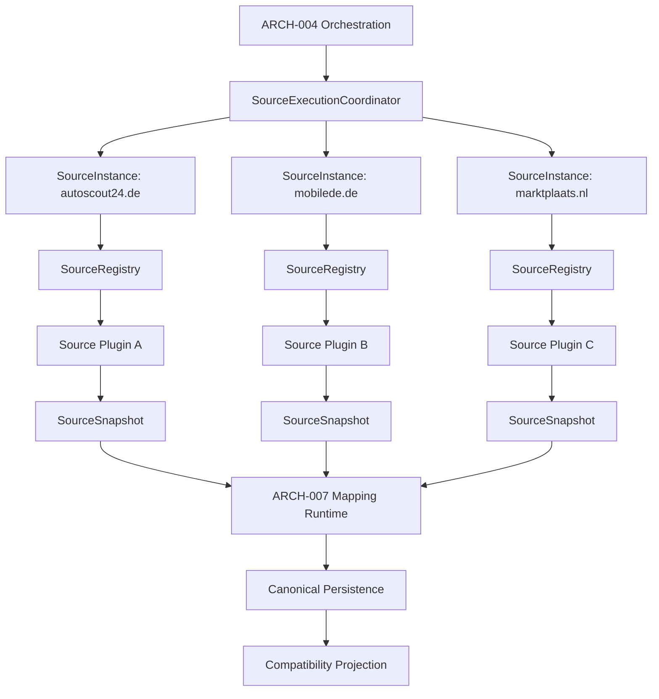

# ARCH-008 – Multi-Source Integration Architecture

**Document ID:** ARCH-008  
**Project:** CarHunter v3  
**Status:** Draft 1.0  
**Scope Type:** Architecture Definition  
**Depends on:** [docs/ARCHITECTURE.md](../ARCHITECTURE.md), [ARCH-002-Source-Framework.md](./ARCH-002-Source-Framework.md), [ARCH-003-Canonical-Car-Domain-Model.md](./ARCH-003-Canonical-Car-Domain-Model.md), [ARCH-004-Pipeline-and-Orchestration.md](./ARCH-004-Pipeline-and-Orchestration.md), [ARCH-005-Generic-Plugin-Framework.md](./ARCH-005-Generic-Plugin-Framework.md), [ARCH-007-Canonical-Persistence-and-Mapping-Runtime.md](./ARCH-007-Canonical-Persistence-and-Mapping-Runtime.md)

## Table of Contents

- [1. Purpose](#1-purpose)
- [2. Scope](#2-scope)
- [3. Architectural Context](#3-architectural-context)
- [4. Terminology](#4-terminology)
- [5. Multi-Source Architecture](#5-multi-source-architecture)
- [6. Source Identity and Registration](#6-source-identity-and-registration)
- [7. Source Instances](#7-source-instances)
- [8. Source Configuration](#8-source-configuration)
- [9. Source Execution Boundary](#9-source-execution-boundary)
- [10. SourceSnapshot Flow](#10-sourcesnapshot-flow)
- [11. Cross-Source Identity](#11-cross-source-identity)
- [12. Duplicate and Conflict Handling](#12-duplicate-and-conflict-handling)
- [13. Failure Isolation](#13-failure-isolation)
- [14. Concurrency](#14-concurrency)
- [15. Dry-Run Semantics](#15-dry-run-semantics)
- [16. Provenance](#16-provenance)
- [17. Observability](#17-observability)
- [18. Adding a New Source](#18-adding-a-new-source)
- [19. AutoScout24 Compatibility](#19-autoscout24-compatibility)
- [20. Migration and Implementation Phases](#20-migration-and-implementation-phases)
- [21. Security and Trust Boundary](#21-security-and-trust-boundary)
- [22. Testing Requirements](#22-testing-requirements)
- [23. Non-Goals](#23-non-goals)
- [24. Open Questions](#24-open-questions)
- [25. Decision Summary](#25-decision-summary)

## 1. Purpose

ARCH-008 defines how CarHunter supports multiple independent vehicle sources on top of the architecture already established by [ARCH-002-Source-Framework.md](./ARCH-002-Source-Framework.md), [ARCH-005-Generic-Plugin-Framework.md](./ARCH-005-Generic-Plugin-Framework.md), and [ARCH-007-Canonical-Persistence-and-Mapping-Runtime.md](./ARCH-007-Canonical-Persistence-and-Mapping-Runtime.md).

This document does not redefine source acquisition semantics, canonical domain semantics, orchestration semantics, or persistence semantics. It defines the multi-source integration boundary that makes those systems work together for multiple independent sources without redesigning the core architecture.

The architecture in this document enables:

- multiple source families such as AutoScout24, Mobile.de, and Marktplaats
- multiple configured instances of the same source family
- isolated source execution and failure containment
- deterministic cross-source identity handling
- source-scoped provenance that survives canonical mapping and compatibility projection
- incremental addition of new sources through registration rather than core redesign

## 2. Scope

### 2.1 In Scope

- source plugin registration across multiple families and instances
- source configuration and enablement
- source discovery and execution coordination
- source isolation and failure containment
- `SourceSnapshot` production for each active source
- source-specific mapping boundaries
- cross-source vehicle and listing identity behavior
- provenance across multiple sources
- duplicate handling across sources
- concurrent execution of multiple sources
- dry-run semantics for multi-source execution
- compatibility with the existing AutoScout24 implementation

### 2.2 Out of Scope

- source acquisition semantics and retry policy; those remain under [ARCH-002-Source-Framework.md](./ARCH-002-Source-Framework.md)
- canonical domain semantics; those remain under [ARCH-003-Canonical-Car-Domain-Model.md](./ARCH-003-Canonical-Car-Domain-Model.md)
- orchestration run lifecycle, stage ordering, and run management; those remain under [ARCH-004-Pipeline-and-Orchestration.md](./ARCH-004-Pipeline-and-Orchestration.md)
- generic plugin infrastructure; that remains under [ARCH-005-Generic-Plugin-Framework.md](./ARCH-005-Generic-Plugin-Framework.md)
- canonical persistence and mapping runtime behavior; that remains under [ARCH-007-Canonical-Persistence-and-Mapping-Runtime.md](./ARCH-007-Canonical-Persistence-and-Mapping-Runtime.md)
- scoring, recommendation, watchlists, notifications, UI, and API behavior
- scraping technology, browser automation, and transport implementation details

## 3. Architectural Context

### 3.1 Current-State Baseline

The current merged baseline contains:

- a source abstraction layer with `SourceDescriptor`, `SourceSnapshot`, and `SourceIngestionService`
- a first concrete AutoScout24 adapter
- a compatibility bridge that writes into the legacy `cars` projection
- a pipeline that is still effectively single-source in its scrape stage

The current implementation is therefore structurally ready for a source boundary, but it is not yet a full multi-source runtime. The orchestration path still effectively treats the scrape stage as an AutoScout24-only flow.

### 3.2 Target Architecture

The target architecture for ARCH-008 is:

```text
Source Plugin Layer
    ├── AutoScout24
    ├── Mobile.de
    ├── Marktplaats
    └── future-source
        │
        ▼
    SourceSnapshot
        │
        ▼
    ARCH-007 Mapping Runtime
        │
        ▼
    Canonical Domain
        │
        ▼
    ARCH-007 Persistence
        │
        ▼
    Compatibility Projection
```

The source plugin layer MUST remain the owner of acquisition semantics. It MUST NOT write canonical persistence directly. The mapping runtime and canonical persistence layer remain the authoritative boundary for canonical state.

## 4. Terminology

The following terms are used consistently in this document.

- **Plugin identity**: the implementation identity of a plugin package, such as `autoscout24` or `mobile_de`.
- **Source family**: the abstract marketplace or source category, such as `autoscout24`, `mobile_de`, or `marktplaats`.
- **Source instance**: one configured runtime instance of a source family, such as `autoscout24.de` or `autoscout24.nl`.
- **Source configuration**: the enablement and runtime settings for one source instance, such as region, endpoint, credentials, rate limits, and execution policy.
- **Source run**: one execution invocation for one source instance during a pipeline run.
- **SourceSnapshot**: the source-owned handoff object produced by a source plugin for one source listing.
- **Canonical mapping runtime**: the runtime owned by [ARCH-007-Canonical-Persistence-and-Mapping-Runtime.md](./ARCH-007-Canonical-Persistence-and-Mapping-Runtime.md) that turns `SourceSnapshot` into canonical entities.

The architecture MUST clearly distinguish plugin identity, source family, source instance, source configuration, source run, and `SourceSnapshot`.

## 5. Multi-Source Architecture

### 5.1 Architectural Layering

The multi-source architecture is a coordination layer between:

- source plugins
- the source registry and configuration model
- orchestration execution
- the mapping and persistence runtime

The layering is:

```text
ARCH-004 orchestration
    -> SourceExecutionCoordinator
    -> SourceRegistry
    -> enabled SourceInstance entries
    -> SourcePlugin
    -> SourceSnapshot
    -> ARCH-007 Mapping Runtime
    -> Canonical Domain State
    -> Compatibility Projection
```

### 5.2 Architectural Responsibilities

| Layer | Owns | Must not own |
|---|---|---|
| Source plugin | acquisition semantics, source-specific parsing, source-local identifiers, source-local validation | canonical persistence writes |
| Source integration layer | registration, enablement, instance selection, execution coordination, isolation, diagnostics | canonical meaning |
| ARCH-007 | mapping, canonical persistence, provenance propagation, compatibility projection | source acquisition policy |
| ARCH-004 | run lifecycle, stage ordering, retry orchestration, run accounting | source-specific identity logic |

### 5.3 Multi-Source Runtime Shape

A multi-source run MUST support multiple concurrently active source instances. Each source instance MUST produce an independent stream of `SourceSnapshot` objects. Those snapshots MUST be handed to the mapping runtime as normal input. Source execution MUST be isolated so that one source instance does not depend on another source instance to complete successfully.



### 5.4 Source Integration Contract

The multi-source dispatch boundary MUST be expressed through four explicit architectural roles:

- **SourceRegistry**: registration and resolution only. It MUST map a source family or instance identifier to a registered plugin implementation and configuration contract. It MUST NOT execute acquisition, orchestrate runs, or persist any runtime results.
- **SourceInstance**: the runtime/configuration entry for one enabled or disabled configured source. It MUST carry the instance identity, family/plugin binding, enablement state, configuration reference, execution-policy reference, provenance identity, and validation state. It MUST NOT perform orchestration or write persistence.
- **SourceIngestionService**: the per-instance acquisition service below ARCH-004. It MUST receive a resolved `SourceInstance` plus plugin implementation, invoke acquisition, validate the result, and convert the plugin output into `SourceSnapshot` objects. It MUST NOT own multi-source orchestration or canonical persistence.
- **SourceExecutionCoordinator**: the multi-source dispatch layer. It MUST select eligible source instances for the current run, resolve each instance through the registry, invoke the ingestion service for each instance independently, isolate failures between instances, and aggregate the results into a multi-source execution result for ARCH-004.

This contract intentionally creates a narrow dispatch boundary. ARCH-008 owns source dispatch, isolation, and aggregation. ARCH-004 remains authoritative for run lifecycle, retry semantics, scheduling, cancellation, and global orchestration policy.

## 6. Source Identity and Registration

### 6.1 Registration Model

The architecture MUST support a registry that can hold multiple source families and multiple instances. The registry MUST distinguish:

- plugin implementation identity
- source family identity
- source instance identity
- source configuration
- source enablement state

A registry entry MUST be keyed by a stable source instance identifier, not only by plugin implementation name.

### 6.2 SourceRegistry Contract

The `SourceRegistry` is the registration and resolution boundary for multi-source integration. It MUST:

- register plugin families and plugin implementations through descriptors supplied by source plugins
- register configured source instances that resolve to an implementation and configuration contract
- resolve a `SourceInstance` to the correct plugin implementation and family binding
- reject unknown, unregistered, or disabled source instances without executing acquisition logic
- expose the metadata required for selection and enablement without owning orchestration or execution

The `SourceRegistry` MUST NOT:

- execute acquisition or parsing
- orchestrate runs
- select which instances run for a given pipeline invocation
- write canonical persistence, compatibility persistence, or application state

The registry therefore owns registration and lookup only. It does not own source execution semantics.

### 6.3 Registration Contract

Each source plugin MUST expose a descriptor that declares:

- plugin identity
- source family
- display name
- contract version
- capabilities
- configuration contract
- dependency requirements

The registry MUST allow the application to register:

- a source family plugin once
- one or more source instances of that family
- disabled instances without activating them

### 6.4 Example Registration Model

```text
SourceRegistry
    ├── autoscout24 (plugin family)
    │   ├── autoscout24.de
    │   └── autoscout24.nl
    ├── mobile_de (plugin family)
    │   └── mobilede.de
    └── marktplaats (plugin family)
        └── marktplaats.nl
```

The family and instance identifiers are distinct. A plugin implementation may support multiple instances, but each instance is still a separate configured runtime entity.

## 7. Source Instances

### 7.1 Source Family Versus Source Instance

A **source family** identifies the marketplace or provider technology. A **source instance** identifies a configured runtime endpoint or deployment for that family. This distinction is required because the same plugin may be used more than once with different configuration.

Examples:

- `autoscout24` family with `autoscout24.de` and `autoscout24.nl` instances
- `mobile_de` family with `mobilede.de` instance
- `marktplaats` family with `marktplaats.nl` instance

### 7.2 Instance Identity Rules

Each source instance MUST have:

- a stable `instance_id`
- a `source_family` identifier
- a `plugin_id` or resolved plugin reference
- an enablement state
- a configuration reference
- an execution policy reference when applicable
- a provenance identity for telemetry and mapping attribution
- a validation state that records whether the instance is structurally valid for the current run

The instance identifier MUST be used as the runtime identity within the orchestration and telemetry layers. The family identifier MUST be used to select the plugin implementation.

### 7.3 Instance Ownership Boundaries

A `SourceInstance` MUST own:

- its own endpoint or region configuration
- its own enablement state
- its own validation state
- its own run history and diagnostics
- its own per-source discovery and snapshot stream

A `SourceInstance` MUST NOT:

- perform orchestration
- write canonical persistence
- write compatibility persistence
- own scoring, recommendation, watchlist, or notification state
- own retry policy or scheduling semantics that are reserved for ARCH-004

An instance MUST NOT be confused with a canonical entity such as a `Vehicle` or `Listing`.

## 8. Source Configuration

### 8.1 Configuration Model

Source configuration MUST be represented as data that can be resolved per source instance. The configuration contract MUST include at least:

- `enabled`
- `source_family`
- `instance_id`
- `display_name`
- `contract_version`
- `capability_overrides`
- `endpoint` or region settings when required
- `request policy references`
- `dry_run` policy if applicable

### 8.2 Enablement and Selection

A source instance MUST be considered active only when both of the following are true:

- the instance is enabled in configuration
- the orchestration layer selects it for the current run

Disabled source instances MUST be skipped without producing snapshots and without affecting other instances.

### 8.3 Configuration Evolution

Configuration MUST be source-instance scoped and MUST NOT require a core rewrite when a new source instance is added. Adding a new instance MUST be possible by adding an instance configuration entry and registering it with the registry.

## 9. Source Execution Boundary

### 9.1 Execution Ownership

The source execution boundary owns the following responsibilities:

- selecting enabled source instances for a run
- resolving each selected instance through the registry
- invoking the correct source plugin for each instance
- collecting raw acquisition results as `SourceSnapshot` objects
- isolating per-instance failures and diagnostics
- handing snapshots to the mapping runtime

The source execution boundary MUST NOT write canonical persistence directly.

### 9.2 SourceIngestionService Contract

The `SourceIngestionService` is the per-instance acquisition service below ARCH-004. It MUST:

- receive a resolved `SourceInstance` and its plugin implementation
- invoke acquisition semantics for that one instance
- validate the plugin result and normalize it into `SourceSnapshot` objects when the contract permits
- return a per-instance execution result that can be reported to the coordinator and to ARCH-004

The `SourceIngestionService` MUST remain below ARCH-004 orchestration and above the plugin implementation. It MUST NOT own multi-source orchestration, canonical persistence, compatibility persistence, or source-instance selection.

### 9.3 SourceExecutionCoordinator Contract

The `SourceExecutionCoordinator` is the multi-source dispatch layer. Its inputs MUST include:

- the source instances selected for the current run
- the active run context supplied by ARCH-004
- dry-run mode
- relevant execution configuration and instance metadata

Its responsibilities MUST be limited to:

1. resolving enabled `SourceInstance` entries for the current run
2. resolving each `SourceInstance` to its registered plugin implementation
3. invoking `SourceIngestionService` independently for each instance
4. isolating failures between instances
5. collecting per-instance results and any produced `SourceSnapshot` objects
6. returning an aggregate multi-source execution result to ARCH-004

The `SourceExecutionCoordinator` MUST NOT own:

- canonical persistence
- Vehicle identity
- Listing identity
- Observation creation
- provenance persistence
- scoring
- recommendation
- watchlist
- notifications
- retry policy or orchestration semantics reserved for ARCH-004

### 9.4 Execution Result Contract

The multi-source boundary MUST use explicit execution result objects. The minimum contract is:

- **SourceExecutionResult**: one result per source instance, carrying at least:
  - `source_instance_id`
  - `source_family`
  - `run_id`
  - `status`
  - `snapshot_count`
  - `accepted_count`
  - `rejected_count`
  - `duration`
  - `error_category`
  - `error_message` or error reference
  - `started_at`
  - `completed_at`
  - `dry_run`

Valid statuses MUST be explicit and MUST include at least:

- `SUCCESS`
- `PARTIAL_SUCCESS`
- `FAILED`
- `SKIPPED_DISABLED`
- `SKIPPED_INVALID_CONFIGURATION`

- **MultiSourceExecutionResult**: the aggregate result for the run, carrying at least:
  - `run_id`
  - per-instance results
  - total snapshots produced
  - total accepted and rejected items
  - overall outcome

The architecture MUST distinguish between:

- **source failure**: one source instance failed while other instances completed successfully
- **partial source success**: some snapshots were produced and accepted while other snapshots or source instances failed
- **global run failure**: the overall run cannot continue because the orchestration contract or a required global dependency is broken

A failed source MUST NOT automatically make the entire multi-source run fail.

### 9.5 ARCH-004 Integration

ARCH-004 remains the authoritative owner of overall run lifecycle, stage ordering, scheduling, cancellation, and global run status. ARCH-008 defines only the multi-source dispatch and isolation boundary within that run.

ARCH-004 MUST receive:

- the aggregate multi-source execution result
- per-instance execution results for observability and diagnostics
- source-level status that can be reported to operators

ARCH-004 MUST decide whether the overall run is successful, partially successful, or failed based on the global orchestration policy. ARCH-008 MUST NOT introduce a second retry or scheduling engine.

### 9.6 Execution Isolation

Source execution MUST be isolated at the instance level. A failure in one source instance MUST NOT block the execution of other source instances. A malformed snapshot or incompatible contract from one source instance MUST be contained and reported without invalidating successful work from independent sources.

### 9.7 Execution Coordination

The orchestration layer owned by [ARCH-004-Pipeline-and-Orchestration.md](./ARCH-004-Pipeline-and-Orchestration.md) MUST remain the authority for run lifecycle and stage ordering. ARCH-008 defines the multi-source dispatch boundary inside that orchestration context.

## 10. SourceSnapshot Flow

### 10.1 SourcePlugin Output

Each source plugin MUST produce a stream of `SourceSnapshot` objects. A `SourceSnapshot` MUST remain source-owned and MUST preserve:

- source family identity
- source instance identity
- source-local listing identifier
- source URL or equivalent source-local locator
- acquisition timestamps and source-local raw payloads
- extracted fields and field-level provenance

### 10.2 Mapping Hand-off

The mapping runtime owned by [ARCH-007-Canonical-Persistence-and-Mapping-Runtime.md](./ARCH-007-Canonical-Persistence-and-Mapping-Runtime.md) MUST accept snapshots from multiple source instances. The `SourceExecutionCoordinator` MUST hand the snapshots to the mapping runtime as a collection of source-owned records, while retaining per-instance execution results for operator visibility. The mapping runtime MUST convert those snapshots into canonical domain state using the canonical persistence contract defined by ARCH-007.

### 10.3 Multi-Source Intake

The multi-source architecture MUST support ingestion from more than one source owner in a single run. The order of execution MUST NOT be assumed to be deterministic across sources unless orchestration defines it. The mapping runtime MUST be deterministic with respect to canonical writes when a stable ordering is present.

## 11. Cross-Source Identity

### 11.1 Canonical Vehicle Identity

Canonical Vehicle identity MUST remain source-independent. The deterministic identity rules defined by [ARCH-007-Canonical-Persistence-and-Mapping-Runtime.md](./ARCH-007-Canonical-Persistence-and-Mapping-Runtime.md) MUST be used for canonical Vehicle identity.

This architecture MUST NOT introduce fuzzy matching, confidence scoring, or heuristic similarity-based merging across sources.

### 11.2 Listing Identity

A listing is source-specific. A listing from AutoScout24 and a listing from Mobile.de MUST remain distinct source listings even when they refer to the same canonical Vehicle.

The relationship is therefore:

```text
AutoScout24 listing A -> Listing L1 -> Vehicle V123
Mobile.de listing B -> Listing L2 -> Vehicle V123
```

`L1` and `L2` are separate listings. `V123` is the canonical vehicle identity shared by both listings if the mapping runtime deterministically resolves them to the same vehicle.

### 11.3 Source-Scoped Identifiers

The source-local listing identifier MUST remain scoped to the source instance. The canonical mapping runtime MUST preserve that scope and MUST NOT collapse it into a canonical-only identifier.

### 11.4 Uncertain Identity

If the deterministic canonical identity rules cannot resolve a mapping to a single canonical Vehicle, the mapping runtime MUST leave the relationship provisional. The architecture MUST NOT silently merge two distinct source listings into one canonical Vehicle when the identity evidence is insufficient.

## 12. Duplicate and Conflict Handling

### 12.1 Duplicate Detection

The architecture MUST distinguish between:

- duplicate source listings from the same source instance
- duplicate source listings from different source instances
- same canonical Vehicle appearing through multiple source listings

A repeated `SourceSnapshot` with an identical semantic payload MUST be treated as duplicate observation data, not as a new canonical vehicle or a new canonical listing.

### 12.2 Source Listing Reuse

The same source-local listing identifier MUST NOT be reused across different source instances without explicit source-instance scoping. A source instance MUST be part of the identity key for source-local listing uniqueness.

### 12.3 Conflict Rules

When two source instances report contradictory facts about the same canonical Vehicle, the architecture MUST preserve both source observations and MUST route the conflict to canonical mapping and provenance handling. The canonical persistence layer MUST NOT overwrite source-specific evidence with a later source-only decision.

### 12.4 No Fuzzy Merge

The architecture MUST NOT use fuzzy or confidence-based matching to merge listings across sources. Deterministic identity and explicit provenance are the only accepted mechanisms.

## 13. Failure Isolation

### 13.1 Per-Source Failure Containment

Each source instance MUST be executed independently. A failure in one source instance MUST NOT invalidate successful snapshots from other instances.

Examples:

- AutoScout24 fails while Mobile.de succeeds
- one source times out while another completes
- one source emits malformed snapshots while another emits valid ones
- one source is disabled while another remains active
- one source reports an incompatible contract version while another is compatible

### 13.2 Failure Handling Contract

The multi-source integration layer MUST:

- record source-level errors and diagnostics
- preserve partial results from successful sources
- prevent a failed source from blocking the overall run when the orchestration policy allows partial success
- surface a per-source failure status to operators and telemetry

### 13.3 Boundary with ARCH-004

Retry and recovery policy MUST remain under [ARCH-004-Pipeline-and-Orchestration.md](./ARCH-004-Pipeline-and-Orchestration.md). ARCH-008 defines only the containment semantics and the observable outcome shape.

## 14. Concurrency

### 14.1 Concurrent Source Execution

The architecture MUST support concurrent execution of multiple source instances. The execution model is:

```text
AutoScout24 -> SourceSnapshot
Mobile.de   -> SourceSnapshot
Marktplaats -> SourceSnapshot
```

Each source instance MAY execute concurrently. The mapping runtime MUST be able to receive snapshots from multiple sources without requiring serialization by source family.

### 14.2 Canonical Write Ordering

The canonical persistence layer and the mapping runtime MUST use deterministic ordering rules for canonical writes when multiple sources produce snapshots concurrently. The architecture MUST preserve the same canonical effect regardless of the order in which sources complete.

### 14.3 Idempotency During Concurrency

The architecture MUST preserve idempotency semantics defined by [ARCH-007-Canonical-Persistence-and-Mapping-Runtime.md](./ARCH-007-Canonical-Persistence-and-Mapping-Runtime.md). Replaying the same semantic snapshot MUST not create duplicate canonical state.

## 15. Dry-Run Semantics

### 15.1 Dry-Run Purpose

Dry-run mode MUST permit a source execution to proceed far enough to:

- discover listings where allowed
- parse and validate the source payload
- build `SourceSnapshot` objects
- produce diagnostics and metrics
- exercise the mapping boundary without mutating canonical persistence

### 15.2 Dry-Run Restrictions

Dry-run MUST NOT:

- mutate canonical persistence
- mutate the compatibility projection
- mutate application state derived from canonical state
- create durable source-run state that would change the runtime semantics of a later non-dry-run execution

### 15.3 Dry-Run Isolation

Dry-run execution MUST remain source-isolated. A dry-run for one source instance MUST NOT alter the observable state of another source instance.

## 16. Provenance

### 16.1 Provenance Contract

The multi-source architecture MUST preserve provenance across the complete flow:

```text
SourceSnapshot
    -> Mapping Runtime
    -> Canonical Entity
    -> Observation
    -> Compatibility Projection
```

Each canonical record produced from a source snapshot MUST retain enough provenance to answer:

- which source instance produced the record
- which source family produced the record
- which source-local listing identifier was used
- which source snapshot contributed the data
- which mapping version handled the data
- whether the data came from a dry-run or a live run

### 16.2 Source-Scoped Provenance

The provenance contract MUST preserve source-specific information even when canonical records are merged into a shared canonical Vehicle. Source-specific facts MUST remain attributable to the source instance that reported them.

### 16.3 Append-Only Semantics

When canonical entities are revised by new source data, the architecture MUST preserve prior provenance and MUST NOT overwrite the original acquisition provenance. The mapping runtime and persistence layer retain this responsibility under [ARCH-007-Canonical-Persistence-and-Mapping-Runtime.md](./ARCH-007-Canonical-Persistence-and-Mapping-Runtime.md).

## 17. Observability

### 17.1 Operational Observability Requirements

The multi-source architecture MUST expose per-source observability so that operators can distinguish sources at runtime. The minimum observability fields MUST include:

- source family
- source instance identifier
- source plugin identity
- run identifier
- discovery count
- snapshot count
- successful mapping count
- failed mapping count
- source-specific error summaries
- elapsed time per source instance

### 17.2 Diagnostic Boundaries

The coordinator MUST surface per-instance `SourceExecutionResult` statuses so that operators can distinguish between source success, source failure, partial success, disabled sources, and invalid configuration. The architecture MUST distinguish between:

- source acquisition failures
- mapping failures
- persistence failures
- compatibility-projection failures

This prevents source-level failures from being misattributed to canonical or compatibility infrastructure.

## 18. Adding a New Source

### 18.1 Required Steps

Adding a new source MUST require the following steps:

1. implement a source plugin that produces `SourceSnapshot` objects
2. expose a plugin descriptor and source capabilities
3. register the source family and any required source instances
4. provide configuration for the instance(s)
5. connect the plugin to the execution boundary
6. provide any source-specific mapping rules required by the mapping runtime
7. allow the canonical mapping runtime to consume the new snapshots without changing canonical persistence contracts

### 18.2 Architectural Requirement

If adding a new source requires modifying the canonical persistence model, the architecture has failed. The canonical persistence model MUST remain stable when a new source family is introduced.

### 18.3 Example: Mobile.de

To add Mobile.de, the implementation MUST:

- provide a Mobile.de plugin implementation that satisfies the source contract
- register a Mobile.de family and at least one instance entry
- expose configuration for the instance
- produce `SourceSnapshot` objects that can be consumed by the mapping runtime
- rely on the existing canonical persistence and compatibility boundary rather than adding source-specific persistence writes

## 19. AutoScout24 Compatibility

### 19.1 Compatibility Requirement

The AutoScout24 implementation MUST remain a valid source plugin under the multi-source architecture. The existing AutoScout24 adapter can continue to provide the same source contract, but it MUST be treated as one source family instance within the broader registry model.

### 19.2 Compatibility Boundary

The AutoScout24 adapter MUST continue to own:

- source-specific discovery
- source-specific parsing
- source-local listing identifiers
- AutoScout24-specific field extraction

It MUST NOT directly own canonical persistence writes. Those writes remain under the mapping runtime and canonical persistence layer.

### 19.3 Migration Path

The current AutoScout24 flow can evolve into a multi-source flow by:

1. keeping the AutoScout24 adapter in place
2. registering it as one source instance or family entry
3. extending the orchestration stage to execute more than one enabled source instance
4. preserving the existing compatibility projection path while canonical mapping evolves

## 20. Migration and Implementation Phases

### 20.1 Phase 0: Baseline

The current baseline remains a single-source, AutoScout24-oriented integration path. The architecture in this document does not require a disruptive rewrite of the existing baseline.

### 20.2 Current-to-Target Dispatch Transition

The current execution path is:

```text
ARCH-004 stage_scrape
    -> single autoscout24 ingestion call
```

The target dispatch path is:

```text
ARCH-004 run
    -> SourceExecutionCoordinator
        -> SourceInstance A
            -> SourceRegistry
            -> SourceIngestionService
            -> Plugin A
        -> SourceInstance B
            -> SourceRegistry
            -> SourceIngestionService
            -> Plugin B
        -> aggregate SourceExecutionResult objects
    -> existing ARCH-007 mapping and persistence path
```

This is a migration of dispatch architecture, not a redesign of ARCH-004. ARCH-004 remains the owner of run lifecycle and global orchestration semantics.

### 20.3 Phase 1: Multi-Source Registration

The system introduces:

- a registry capable of multiple source instances
- configuration entries for more than one instance
- an enablement model that can select or exclude instances

### 20.4 Phase 2: Source Execution Coordination

The execution boundary introduces per-source execution, diagnostics, and isolation while preserving the existing mapping and persistence flow.

### 20.5 Phase 3: Cross-Source Identity and Provenance

The mapping runtime and persistence layer begin consuming snapshots from multiple sources and preserve source-specific provenance while resolving canonical Vehicle identity deterministically.

### 20.6 Phase 4: Compatibility and Operational Hardening

The system adds operational observability, dry-run behavior, and source-by-source diagnostics while preserving the compatibility projection path.

## 21. Security and Trust Boundary

### 21.1 Source Data Trust

Source data MUST be treated as externally supplied and potentially untrusted. The system MUST preserve the provenance of that data and MUST NOT allow it to be interpreted as canonical truth without mapping and provenance handling.

### 21.2 Access Control

Secrets, credentials, and endpoint configuration MUST remain bound to source-specific configuration and MUST NOT be embedded in canonical persistence or canonical mapping logic.

### 21.3 Failure and Isolation

Malformed or hostile source data MUST be isolated within the source execution boundary and MUST NOT compromise other sources or the canonical runtime.

## 22. Testing Requirements

The following test categories MUST be covered:

- registry behavior for multiple source families and instances
- enablement and disablement behavior
- isolation of one source instance from another
- dry-run semantics for each source instance
- deterministic handling of duplicate and repeated snapshots
- provenance propagation through mapping and persistence
- cross-source identity behavior for shared vehicles and distinct listings
- concurrent execution behavior with multiple source instances
- compatibility with the existing AutoScout24 adapter

## 23. Non-Goals

ARCH-008 does not define:

- scoring, recommendation, watchlist, notification, or UI semantics
- a new orchestration engine
- a new canonical domain model
- a new persistence model beyond the existing contract established by ARCH-007
- scraping technology or browser automation details
- a new retry policy beyond the containment semantics defined here

## 24. Open Questions

The following architectural questions remain intentionally open at this level of design:

1. Whether source-instance configuration should be stored in a file-based configuration model, a database-backed configuration model, or an environment-driven model.
2. Whether the implementation should persist per-source-instance health state for operational visibility or keep health state transient in the runtime.
3. Whether the first multi-source rollout should enable a small set of source instances in a single run or require a per-instance rollout gate.

These questions do not change the core architectural contract defined in this document.

## 25. Decision Summary

The key architecture decisions in ARCH-008 are:

- multiple source families and source instances MUST be supported through a registry-based integration model
- source plugin identity, source family, source instance, and source configuration MUST be distinct concepts
- source plugins MUST remain source-owned and MUST NOT write canonical persistence directly
- canonical Vehicle identity MUST remain source-independent and deterministic
- source listings MUST remain distinct from canonical vehicles and MUST retain source-scoped identity
- one source instance MUST fail without invalidating successful work from other source instances
- the architecture MUST support concurrent execution and dry-run semantics without changing the canonical persistence contract
- adding a new source MUST be possible without redesigning the canonical persistence and mapping runtime
